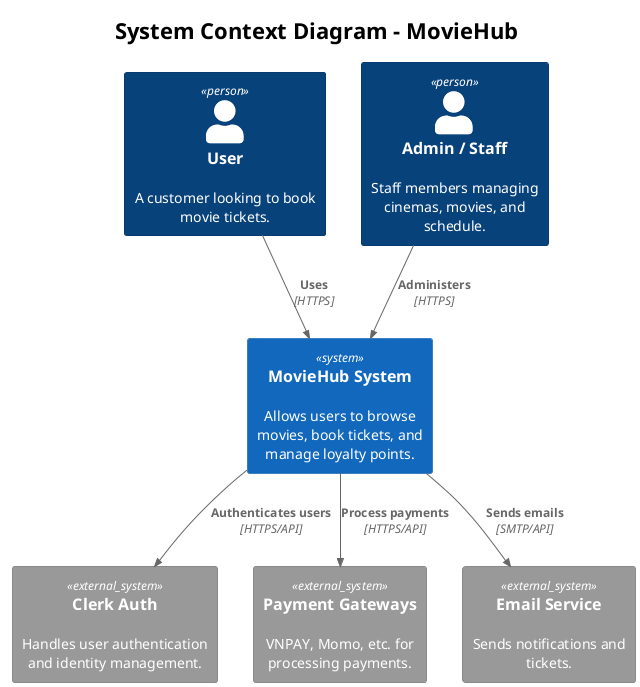
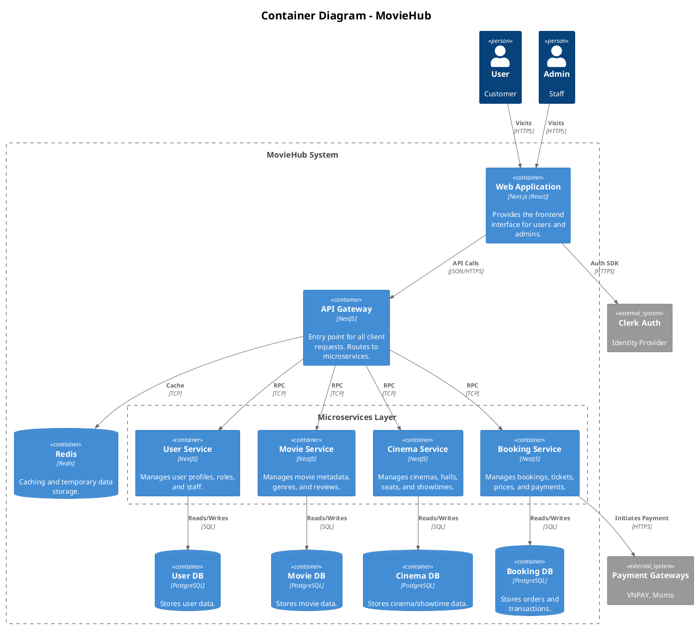

# System Architecture

## System Context Diagram (Level 1)

This diagram shows the high-level context of the MovieHub system and its interactions with external users and systems.

## Container Diagram (Level 2)

This diagram shows the diverse microservices and containers that make up the MovieHub system.

