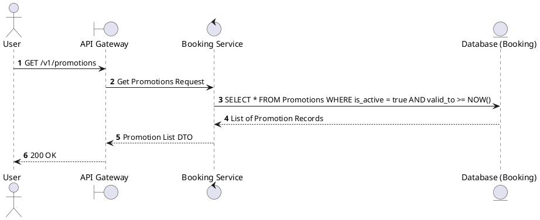
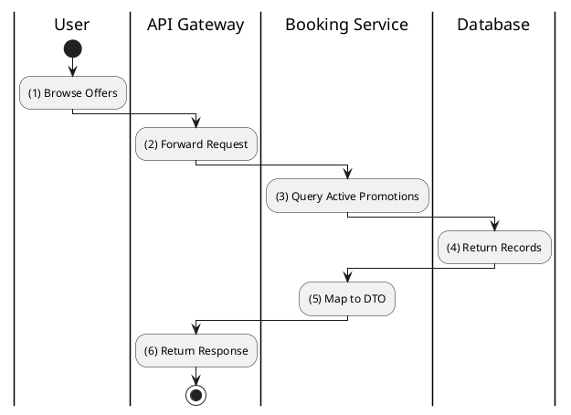

# [PM-01] List Promotions

## 1. Description

| Field | Details |
| :--- | :--- |
| **Name** | List Promotions |
| **Functional ID** | PM-01 |
| **Description** | Retrieves a list of active promotions available to the user. |
| **Actor** | Guest, Member |
| **Trigger** | `GET /v1/promotions` |
| **Pre-condition** | None. |
| **Post-condition** | List of promotions returned. |

## 2. Sequence Flow

## 3. Activity Flow

## 4. Business Rules

| Activity Step | Rule ID | Description |
| :--- | :--- | :--- |
| (3) | BR-PROMO-01 | Promotion must be within valid date range (valid_from to valid_to). |
| (3) | N/A | Only promotions marked as `is_active = true` are displayed. |
| (3) | N/A | Supports various types: PERCENTAGE, FIXED_AMOUNT, etc. |
@enduml
