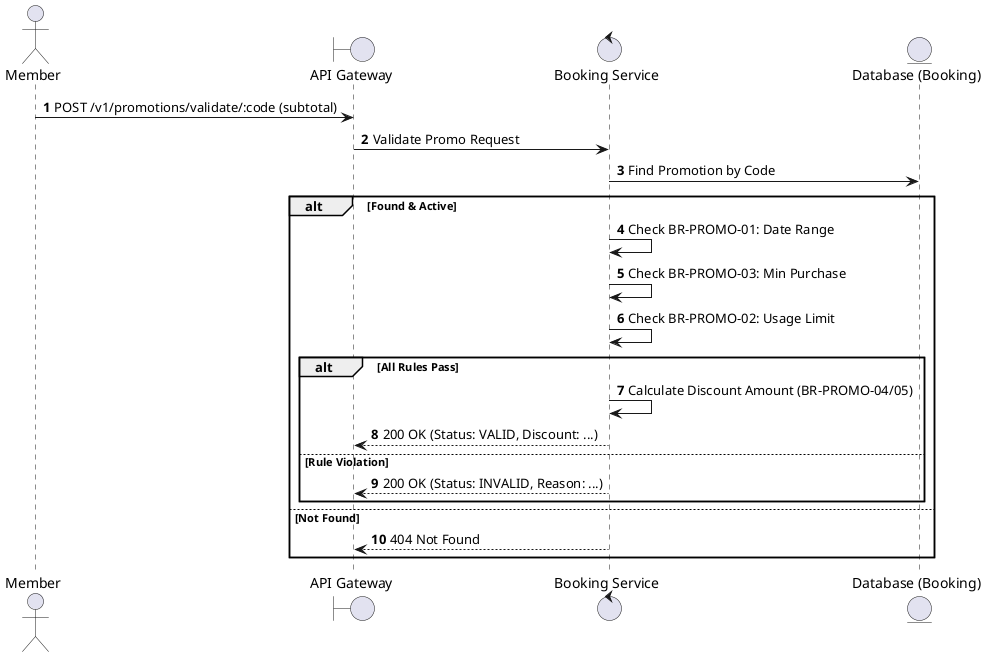
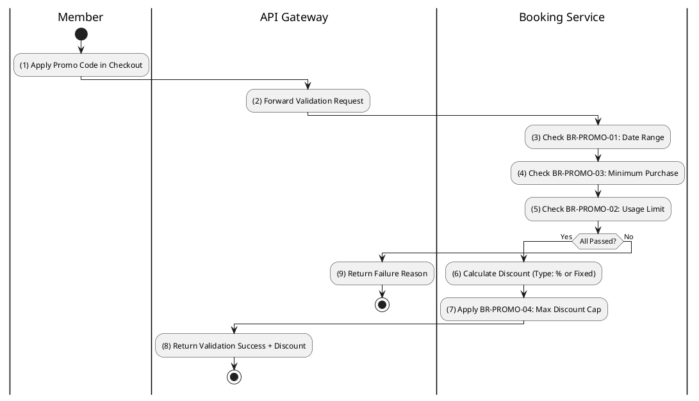

# [PM-04] Validate Promotion Code

## 1. Description

| Field | Details |
| :--- | :--- |
| **Name** | Validate Promotion Code |
| **Functional ID** | PM-04 |
| **Description** | Validates a promotion code against a specific booking subtotal to check if it's applicable. |
| **Actor** | Member |
| **Trigger** | `POST /v1/promotions/validate/:code` |
| **Pre-condition** | Member authenticated; Valid payload (subtotal). |
| **Post-condition** | Validation result (Applicable/Not Applicable) and potential discount returned. |

## 2. Sequence Flow

## 3. Activity Flow

## 4. Business Rules

| Activity Step | Rule ID | Description |
| :--- | :--- | :--- |
| (3) | BR-PROMO-01 | Promotion must be within valid date range. |
| (5) | BR-PROMO-02 | Promotion usage limit is enforced per promotion. |
| (4) | BR-PROMO-03 | Minimum purchase amount is validated before applying promotion. |
| (7) | BR-PROMO-04 | For PERCENTAGE type promotions, max_discount cap is applied. |
| (6) | BR-PROMO-05 | Discount cannot exceed the subtotal amount. |
@enduml
