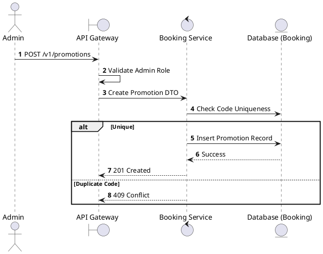
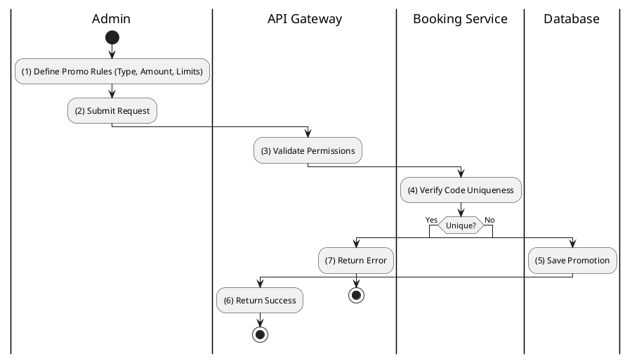

# [PM-05] Create Promotion

## 1. Description

| Field | Details |
| :--- | :--- |
| **Name** | Create Promotion |
| **Functional ID** | PM-05 |
| **Description** | Allows an Administrator to create a new promotional offer or discount code. |
| **Actor** | Admin |
| **Trigger** | `POST /v1/promotions` |
| **Pre-condition** | Admin authenticated; Valid payload (Code, Type, Value, Dates). |
| **Post-condition** | New promotion record created. |

## 2. Sequence Flow

## 3. Activity Flow

## 4. Business Rules

| Activity Step | Rule ID | Description |
| :--- | :--- | :--- |
| (1) | SRS 5.1 | Required: Code, PromotionType, DiscountValue, ValidFrom, ValidTo. |
| (1) | SRS 5.2 | PromotionType must be one of: PERCENTAGE, FIXED_AMOUNT, FREE_ITEM, POINTS. |
