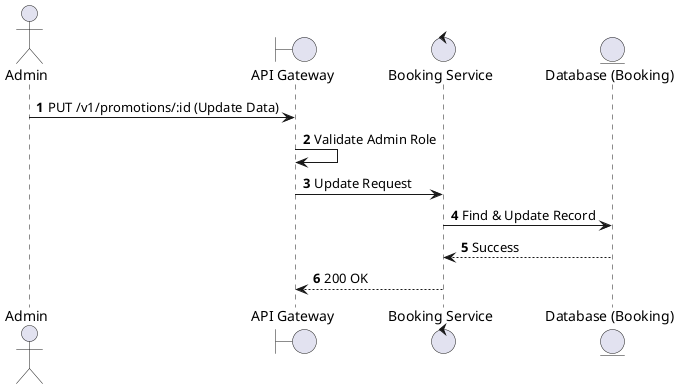
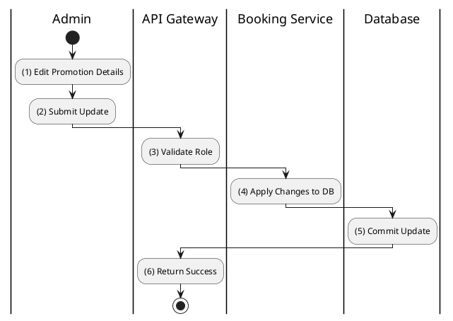

# [PM-06] Update Promotion

## 1. Description

| Field | Details |
| :--- | :--- |
| **Name** | Update Promotion |
| **Functional ID** | PM-06 |
| **Description** | Modifies the terms or details of an existing promotion. |
| **Actor** | Admin |
| **Trigger** | `PUT /v1/promotions/:id` |
| **Pre-condition** | Admin authenticated; Promotion ID exists. |
| **Post-condition** | Promotion record updated. |

## 2. Sequence Flow

## 3. Activity Flow

## 4. Business Rules

| Activity Step | Rule ID | Description |
| :--- | :--- | :--- |
| (4) | N/A | Can update dates, values, and limits. |
| (4) | N/A | Changing the code is generally discouraged but allowed if unique. |
@enduml
