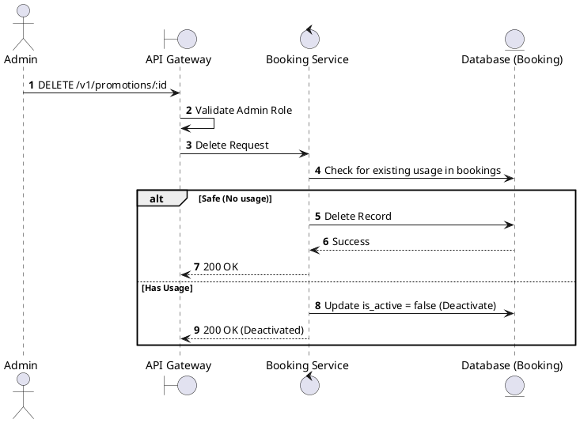
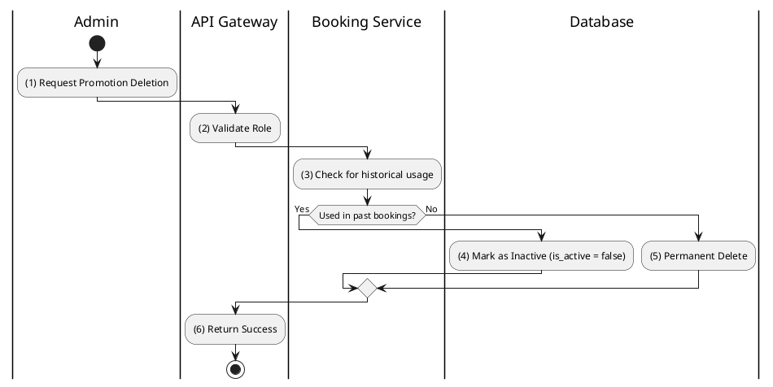

# [PM-07] Delete Promotion

## 1. Description

| Field | Details |
| :--- | :--- |
| **Name** | Delete Promotion |
| **Functional ID** | PM-07 |
| **Description** | Removes a promotion from the system. |
| **Actor** | Admin |
| **Trigger** | `DELETE /v1/promotions/:id` |
| **Pre-condition** | Admin authenticated; Promotion ID exists. |
| **Post-condition** | Promotion record removed or soft-deleted. |

## 2. Sequence Flow

## 3. Activity Flow

## 4. Business Rules

| Activity Step | Rule ID | Description |
| :--- | :--- | :--- |
| (3) | General | Promotions used in completed bookings should be soft-deleted to maintain audit integrity. |
@enduml
