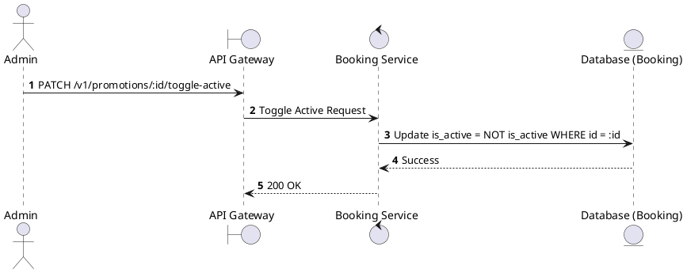
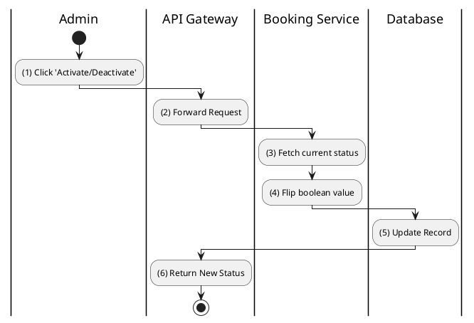

# [PM-08] Toggle Promotion Active

## 1. Description

| Field | Details |
| :--- | :--- |
| **Name** | Toggle Promotion Active |
| **Functional ID** | PM-08 |
| **Description** | Allows an Admin to quickly enable or disable a promotion without deleting it. |
| **Actor** | Admin |
| **Trigger** | `PATCH /v1/promotions/:id/toggle-active` |
| **Pre-condition** | Admin authenticated; Promotion ID exists. |
| **Post-condition** | `is_active` status flipped. |

## 2. Sequence Flow

## 3. Activity Flow

## 4. Business Rules

| Activity Step | Rule ID | Description |
| :--- | :--- | :--- |
| (3) | N/A | Deactivated promotions cannot be validated or used in checkout, even if the code is known. |
@enduml
