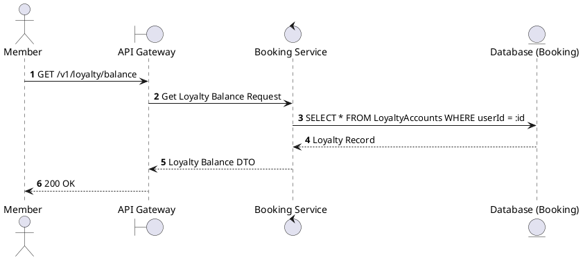
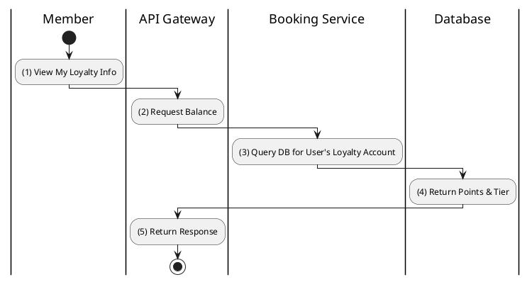

# [LY-01] Get Loyalty Balance

## 1. Description

| Field | Details |
| :--- | :--- |
| **Name** | Get Loyalty Balance |
| **Functional ID** | LY-01 |
| **Description** | Retrieves the current loyalty points balance and membership tier for the authenticated member. |
| **Actor** | Member |
| **Trigger** | `GET /v1/loyalty/balance` |
| **Pre-condition** | Member authenticated. |
| **Post-condition** | Point balance and tier information returned. |

## 2. Sequence Flow

## 3. Activity Flow

## 4. Business Rules

| Activity Step | Rule ID | Description |
| :--- | :--- | :--- |
| (4) | BR-LOYALTY-04 | New loyalty accounts start at BRONZE tier. |
| (4) | SRS 5.2 | Membership tiers: BRONZE, SILVER, GOLD, PLATINUM. |
@enduml
