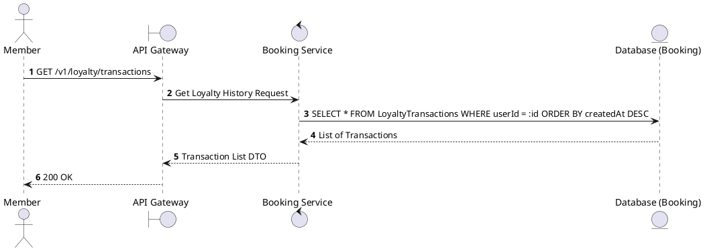
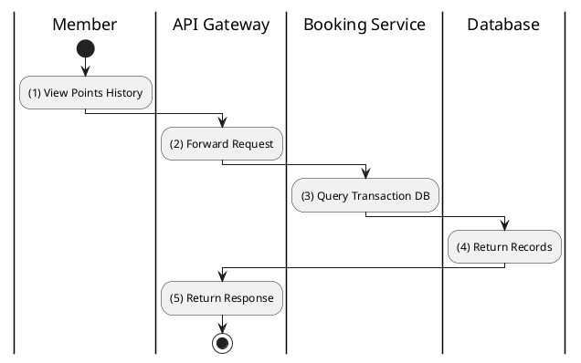

# [LY-02] Get Transaction History

## 1. Description

| Field | Details |
| :--- | :--- |
| **Name** | Get Transaction History |
| **Functional ID** | LY-02 |
| **Description** | Retrieves the history of point earnings and redemptions for the member. |
| **Actor** | Member |
| **Trigger** | `GET /v1/loyalty/transactions` |
| **Pre-condition** | Member authenticated. |
| **Post-condition** | List of loyalty transactions returned. |

## 2. Sequence Flow

## 3. Activity Flow

## 4. Business Rules

| Activity Step | Rule ID | Description |
| :--- | :--- | :--- |
| (3) | SRS 5.2 | Types: EARN, REDEEM, EXPIRE. |
@enduml
