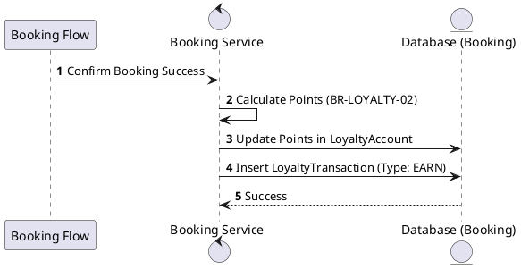
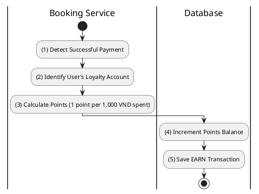

# [LY-03] Earn Points

## 1. Description

| Field | Details |
| :--- | :--- |
| **Name** | Earn Points |
| **Functional ID** | LY-03 |
| **Description** | Automatically adds loyalty points to the user's account after a successful booking confirmation. |
| **Actor** | Member, System |
| **Trigger** | `POST /v1/loyalty/earn` (or internal event) |
| **Pre-condition** | Booking confirmed and paid. |
| **Post-condition** | Points balance increased; Transaction record created. |

## 2. Sequence Flow

## 3. Activity Flow

## 4. Business Rules

| Activity Step | Rule ID | Description |
| :--- | :--- | :--- |
| (3) | BR-LOYALTY-02 | Point earning rate: 1 point per 1,000 VND spent. |
| (4) | N/A | Total spend used for calculation is typically the subtotal after discounts. |
@enduml
