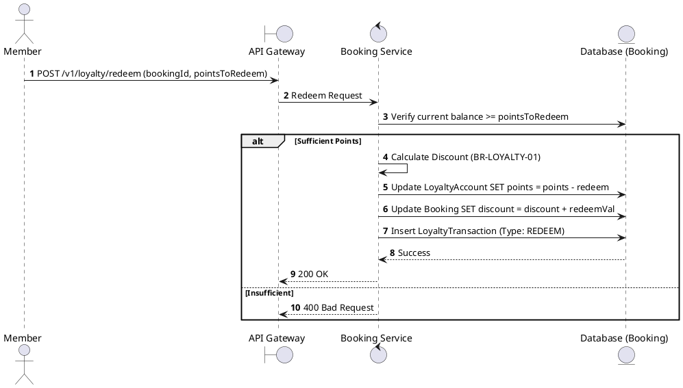
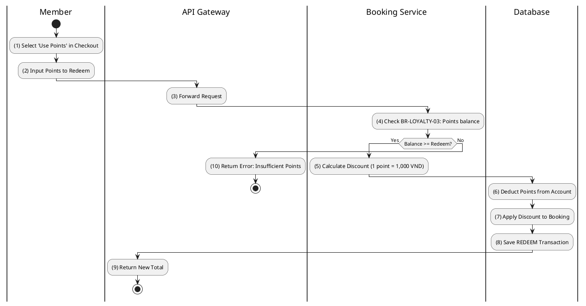

# [LY-04] Redeem Points

## 1. Description

| Field | Details |
| :--- | :--- |
| **Name** | Redeem Points |
| **Functional ID** | LY-04 |
| **Description** | Allows a member to use their accumulated loyalty points to pay for part or all of a booking. |
| **Actor** | Member |
| **Trigger** | `POST /v1/loyalty/redeem` |
| **Pre-condition** | Member has sufficient points; Booking is in PENDING status. |
| **Post-condition** | Points deducted; Booking total reduced; Transaction record created. |

## 2. Sequence Flow

## 3. Activity Flow

## 4. Business Rules

| Activity Step | Rule ID | Description |
| :--- | :--- | :--- |
| (5) | BR-LOYALTY-01 | Point redemption rate: 1 point = 1,000 VND. |
| (4) | BR-LOYALTY-03 | Users cannot redeem more points than their current balance. |
| (7) | N/A | Total discount cannot exceed the booking subtotal. |
@enduml
