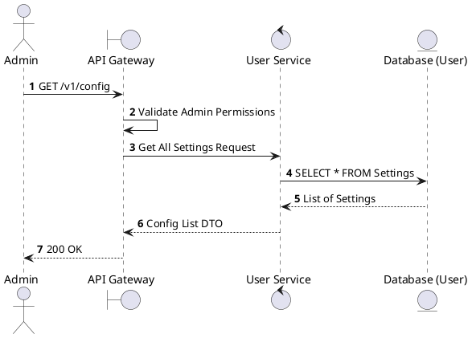
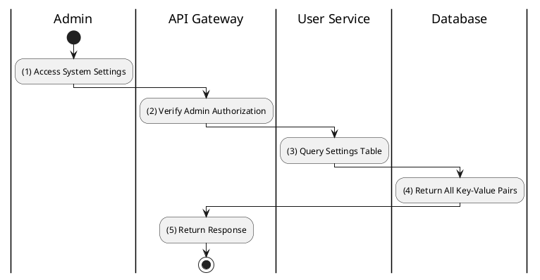

# [CF-01] Get All Settings

## 1. Description

| Field | Details |
| :--- | :--- |
| **Name** | Get All Settings |
| **Functional ID** | CF-01 |
| **Description** | Retrieves all system-wide configuration settings and key-value pairs. |
| **Actor** | Admin |
| **Trigger** | `GET /v1/config` |
| **Pre-condition** | Admin authenticated. |
| **Post-condition** | List of all settings returned. |

## 2. Sequence Flow

## 3. Activity Flow

## 4. Business Rules

| Activity Step | Rule ID | Description |
| :--- | :--- | :--- |
| (2) | N/A | Settings include things like VAT rate, cancellation deadlines, etc. (SRS 5.1). |
| (2) | N/A | Only accessible to the Admin actor. |
@enduml
