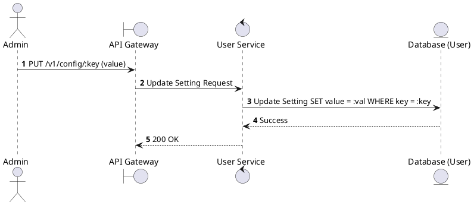
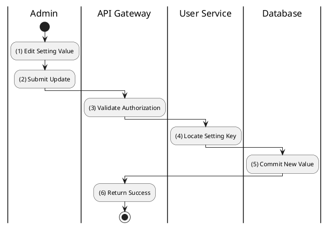

# [CF-02] Update Setting

## 1. Description

| Field | Details |
| :--- | :--- |
| **Name** | Update Setting |
| **Functional ID** | CF-02 |
| **Description** | Allows an Administrator to update the value of a specific system configuration setting. |
| **Actor** | Admin |
| **Trigger** | `PUT /v1/config/:key` |
| **Pre-condition** | Admin authenticated; Setting key exists. |
| **Post-condition** | Setting value updated in database. |

## 2. Sequence Flow

## 3. Activity Flow

## 4. Business Rules

| Activity Step | Rule ID | Description |
| :--- | :--- | :--- |
| (5) | N/A | Changes to critical settings (like VAT) may have immediate system-wide financial impact. |
| (5) | N/A | Values are typically stored as strings and cast by the consuming service. |
@enduml
