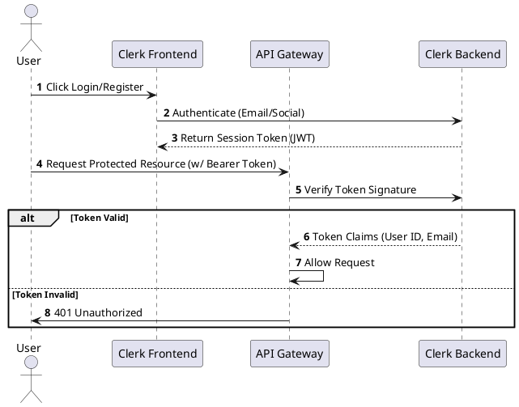
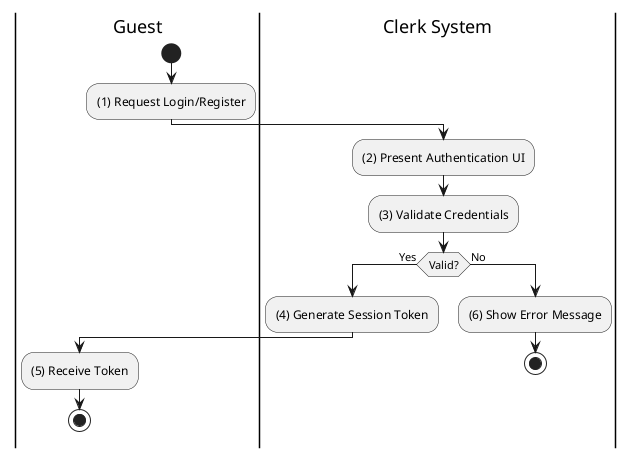

# [UM-01] User Authentication

## 1. Description

| Field | Details |
| :--- | :--- |
| **Name** | User Authentication |
| **Functional ID** | UM-01 |
| **Description** | Allows guests to sign up or log in via Clerk (external identity provider) and obtain a session token for accessing protected resources. |
| **Actor** | Guest, Member |
| **Trigger** | External Interaction (Clerk UI) |
| **Pre-condition** | User has a valid email or social account. |
| **Post-condition** | User receives a JWT token; User session is established. |

## 2. Sequence Flow

## 3. Activity Flow

## 4. Business Rules

| Activity Step | Rule ID | Description |
| :--- | :--- | :--- |
| (1) | N/A | Authentication is handled entirely by Clerk (Third-party). |
| (5) | N/A | Tokens must be included in the `Authorization` header for all protected API calls (Section 6.1). |
