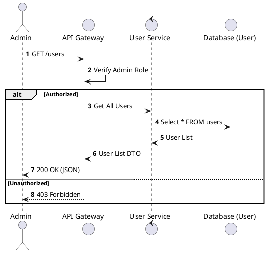
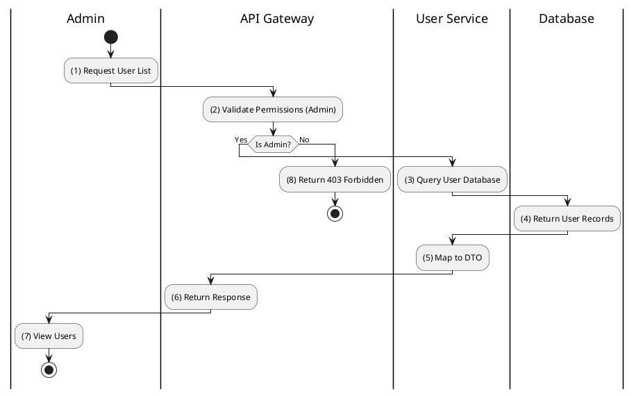

# [UM-02] List Users

## 1. Description

| Field | Details |
| :--- | :--- |
| **Name** | List Users |
| **Functional ID** | UM-02 |
| **Description** | Allows Administrators to view a list of all registered users in the system. |
| **Actor** | Admin |
| **Trigger** | `GET /users` |
| **Pre-condition** | Actor is authenticated and has `ADMIN` role. |
| **Post-condition** | List of users is returned. |

## 2. Sequence Flow

## 3. Activity Flow

## 4. Business Rules

| Activity Step | Rule ID | Description |
| :--- | :--- | :--- |
| (2) | N/A | Access is restricted to Admin role only (SRS Section 6.3). |
