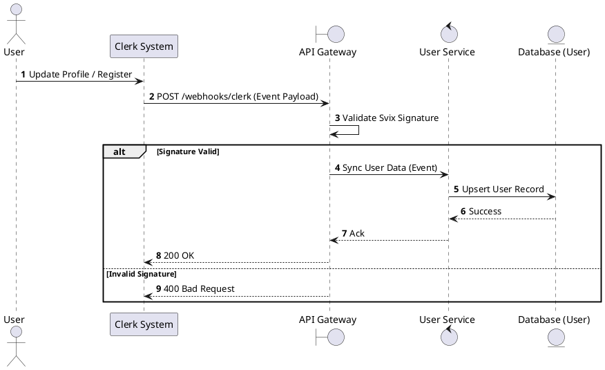
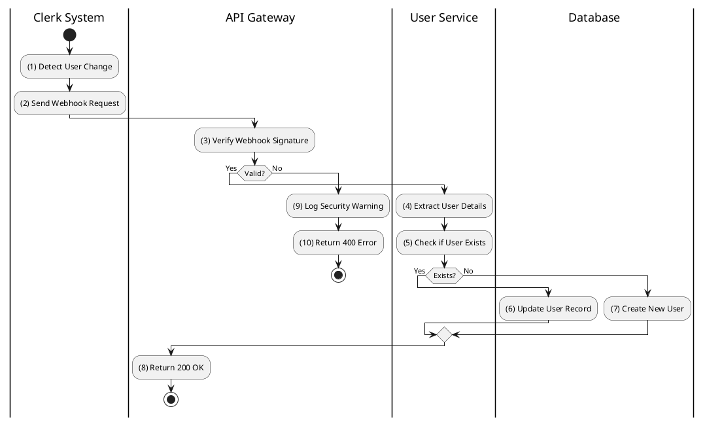

# [UM-03] Get User Profile (Sync)

## 1. Description

| Field | Details |
| :--- | :--- |
| **Name** | Get User Profile (Clerk Webhook Sync) |
| **Functional ID** | UM-03 |
| **Description** | Synchronizes user data from Clerk to the local User Service database via Webhook when a user registers or updates their profile in Clerk. |
| **Actor** | Member (via Clerk System) |
| **Trigger** | Clerk Webhook Event (`user.created`, `user.updated`) |
| **Pre-condition** | Valid Webhook Signature from Clerk. |
| **Post-condition** | User record created or updated in `postgres-user`. |

## 2. Sequence Flow

## 3. Activity Flow

## 4. Business Rules

| Activity Step | Rule ID | Description |
| :--- | :--- | :--- |
| (3) | N/A | Webhooks must be verified using the Svix secret to prevent spoofing. |
| (7) | BR-LOYALTY-04 | New accounts may need initialization of Loyalty Account (Bronze Tier). |
