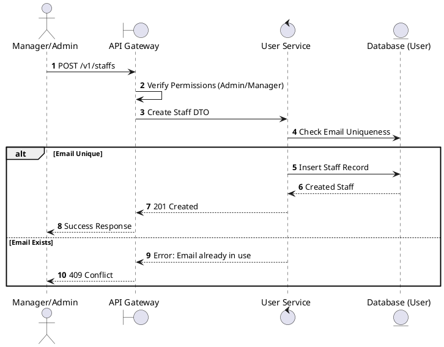
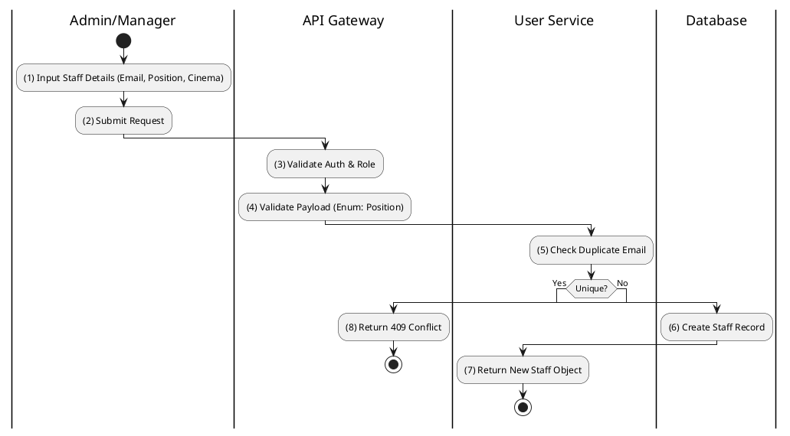

# [UM-04] Create Staff

## 1. Description

| Field | Details |
| :--- | :--- |
| **Name** | Create Staff |
| **Functional ID** | UM-04 |
| **Description** | Allows Admins or Cinema Managers to create a new staff account with a specific position and assignment. |
| **Actor** | Admin, Cinema Manager |
| **Trigger** | `POST /v1/staffs` |
| **Pre-condition** | Admin/Manager logged in; Valid payload (email, position). |
| **Post-condition** | New Staff record created in DB. |

## 2. Sequence Flow

## 3. Activity Flow

## 4. Business Rules

| Activity Step | Rule ID | Description |
| :--- | :--- | :--- |
| (4) | SRS 2.2 | Position must be one of: `TICKET_CLERK`, `CONCESSION_STAFF`, `USHER`, `PROJECTIONIST`, `CLEANER`, `SECURITY`, etc. |
| (6) | SRS 5.1 | Staff record links to User account (via Clerk ID possibly) or stands alone as internal record. |
