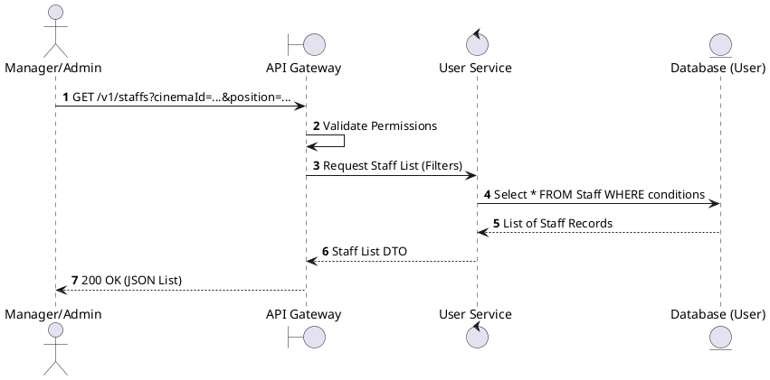
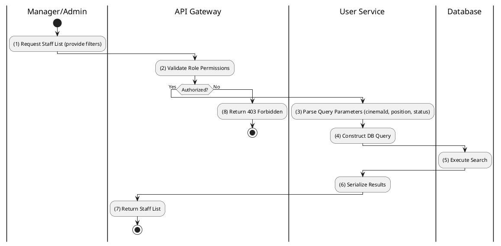

# [UM-05] List Staff

## 1. Description

| Field | Details |
| :--- | :--- |
| **Name** | List Staff |
| **Functional ID** | UM-05 |
| **Description** | Allows Admins or Cinema Managers to view a list of staff members, with filtering options for cinema location, position, and employment status. |
| **Actor** | Admin, Cinema Manager |
| **Trigger** | `GET /v1/staffs` |
| **Pre-condition** | User is authenticated with `ADMIN` or `CINEMA_MANAGER` role. |
| **Post-condition** | A filtered list of staff members is returned. |

## 2. Sequence Flow

## 3. Activity Flow

## 4. Business Rules

| Activity Step | Rule ID | Description |
| :--- | :--- | :--- |
| (2) | SRS 3.1 | Query Parameters supported: `cinemaId` (Filter by location), `position` (Filter by StaffPosition enum), `status` (ACTIVE/INACTIVE). |
| (4) | SRS 2.3 | Cinema Managers should typically only see staff assigned to their specific cinema (Implicit data scoping rule). |
