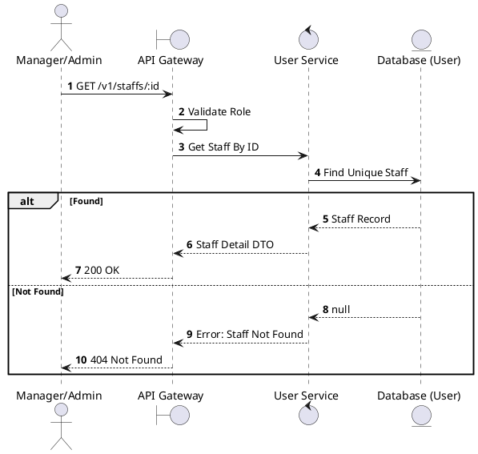
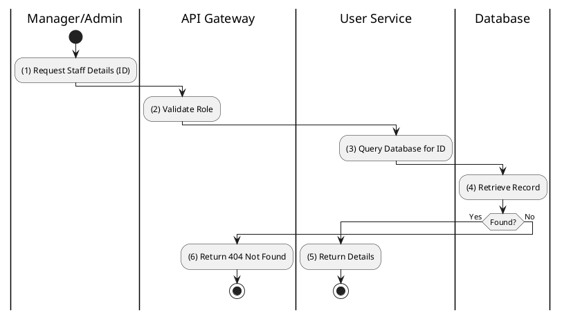

# [UM-06] Get Staff Details

## 1. Description

| Field | Details |
| :--- | :--- |
| **Name** | Get Staff Details |
| **Functional ID** | UM-06 |
| **Description** | Retrieves detailed information about a specific staff member by their unique ID. |
| **Actor** | Admin, Cinema Manager |
| **Trigger** | `GET /v1/staffs/:id` |
| **Pre-condition** | Staff ID exists; User is authenticated with appropriate privileges. |
| **Post-condition** | Detailed staff profile is returned. |

## 2. Sequence Flow

## 3. Activity Flow

## 4. Business Rules

| Activity Step | Rule ID | Description |
| :--- | :--- | :--- |
| (1) | N/A | Standard CRUD operation. No complex business logic defined in SRS beyond access control. |
