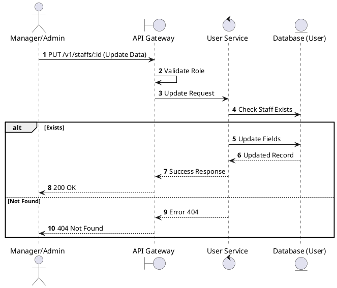
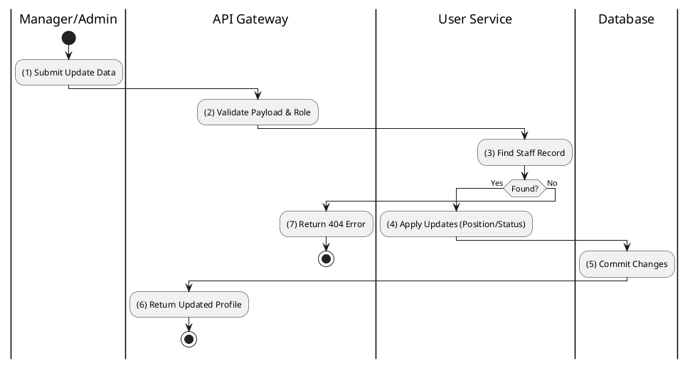

# [UM-07] Update Staff

## 1. Description

| Field | Details |
| :--- | :--- |
| **Name** | Update Staff |
| **Functional ID** | UM-07 |
| **Description** | Updates the information of an existing staff member (e.g., position, status, assignment). |
| **Actor** | Admin, Cinema Manager |
| **Trigger** | `PUT /v1/staffs/:id` |
| **Pre-condition** | Staff ID exists; User authorized; Valid update payload. |
| **Post-condition** | Staff record is updated in the database. |

## 2. Sequence Flow

## 3. Activity Flow

## 4. Business Rules

| Activity Step | Rule ID | Description |
| :--- | :--- | :--- |
| (4) | SRS 5.2 | Updates to `Position` must be valid `StaffPosition` enum values. |
| (4) | SRS 5.2 | Updates to `Status` must be valid `StaffStatus` (ACTIVE/INACTIVE). |
