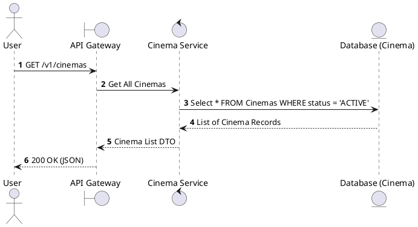
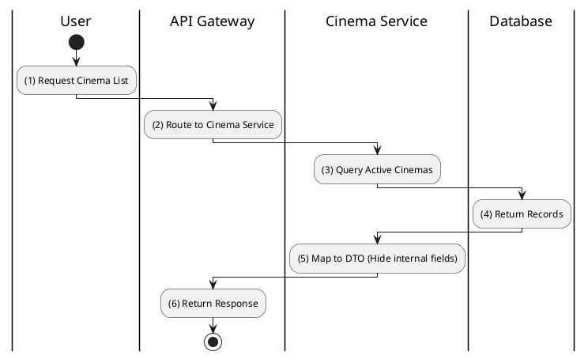

# [CM-01] List All Cinemas

## 1. Description

| Field | Details |
| :--- | :--- |
| **Name** | List All Cinemas |
| **Functional ID** | CM-01 |
| **Description** | Retrieves a list of all active cinema locations available in the system. |
| **Actor** | Guest, Member |
| **Trigger** | `GET /v1/cinemas` |
| **Pre-condition** | None (Public endpoint). |
| **Post-condition** | List of cinemas returned to user. |

## 2. Sequence Flow

## 3. Activity Flow

## 4. Business Rules

| Activity Step | Rule ID | Description |
| :--- | :--- | :--- |
| (3) | SRS 5.2 | Only cinemas with `CinemaStatus` = `ACTIVE` should be visible to public users. |
