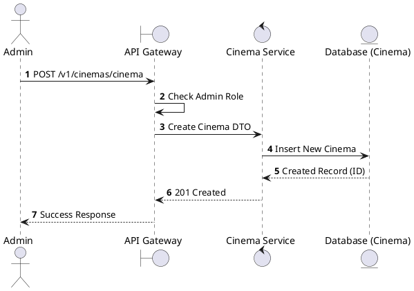
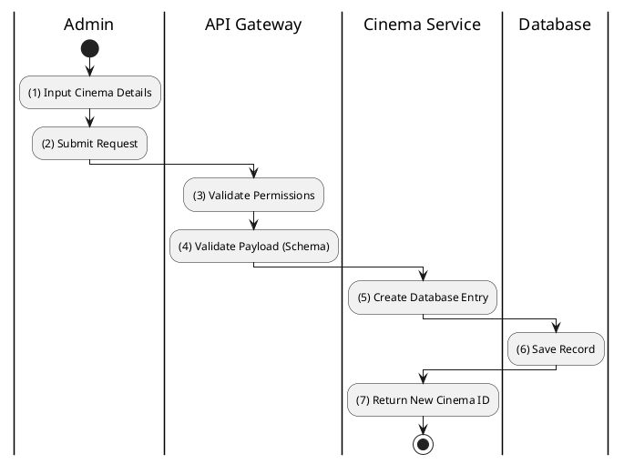

# [CM-02] Create Cinema

## 1. Description

| Field | Details |
| :--- | :--- |
| **Name** | Create Cinema |
| **Functional ID** | CM-02 |
| **Description** | Allows an Administrator to register a new cinema location in the system. |
| **Actor** | Admin |
| **Trigger** | `POST /v1/cinemas/cinema` |
| **Pre-condition** | Admin authenticated; Valid payload (Name, Address, City). |
| **Post-condition** | New cinema created in database; Status defaults to ACTIVE or MAINTENANCE. |

## 2. Sequence Flow

## 3. Activity Flow

## 4. Business Rules

| Activity Step | Rule ID | Description |
| :--- | :--- | :--- |
| (1) | SRS 5.1 | Required fields: Name, Address, City, District. Optional: Description, Image URLs. |
