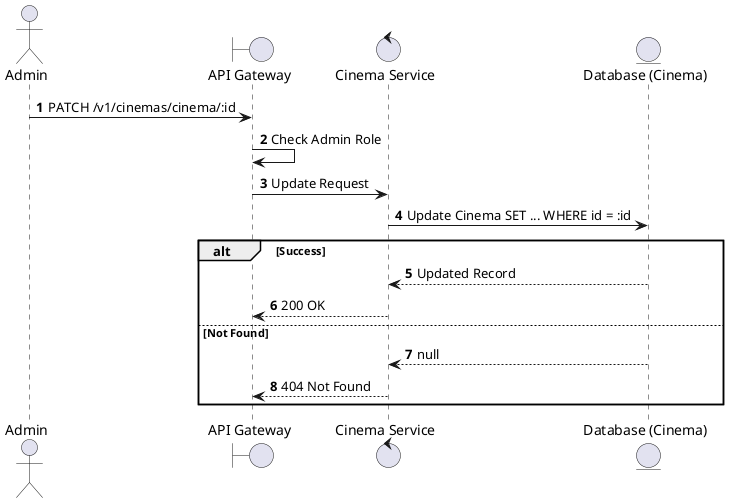
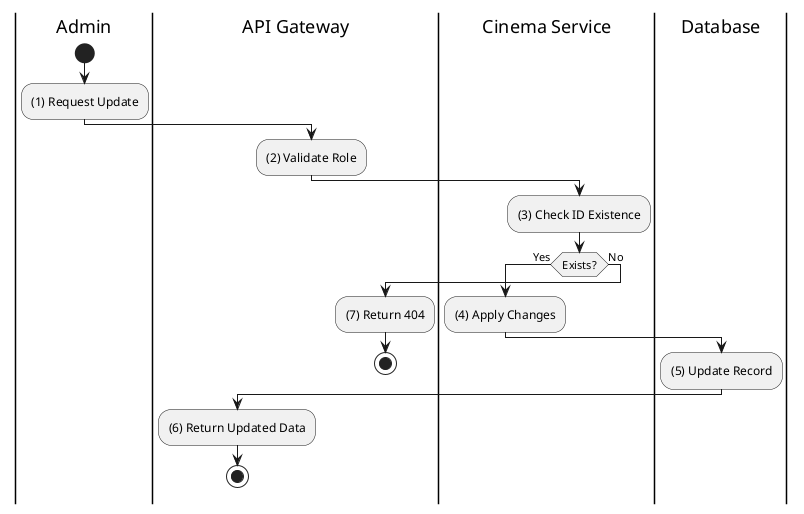

# [CM-03] Update Cinema

## 1. Description

| Field | Details |
| :--- | :--- |
| **Name** | Update Cinema |
| **Functional ID** | CM-03 |
| **Description** | Modifies the details of an existing cinema (e.g., name, address, status). |
| **Actor** | Admin |
| **Trigger** | `PATCH /v1/cinemas/cinema/:cinemaId` |
| **Pre-condition** | Admin authenticated; Cinema ID exists. |
| **Post-condition** | Cinema record updated. |

## 2. Sequence Flow

## 3. Activity Flow

## 4. Business Rules

| Activity Step | Rule ID | Description |
| :--- | :--- | :--- |
| (4) | SRS 5.2 | If status is changed to `CLOSED` or `MAINTENANCE`, it may impact future showtimes (though not explicitly enforced in this atomic op, it's a systemic implication). |
