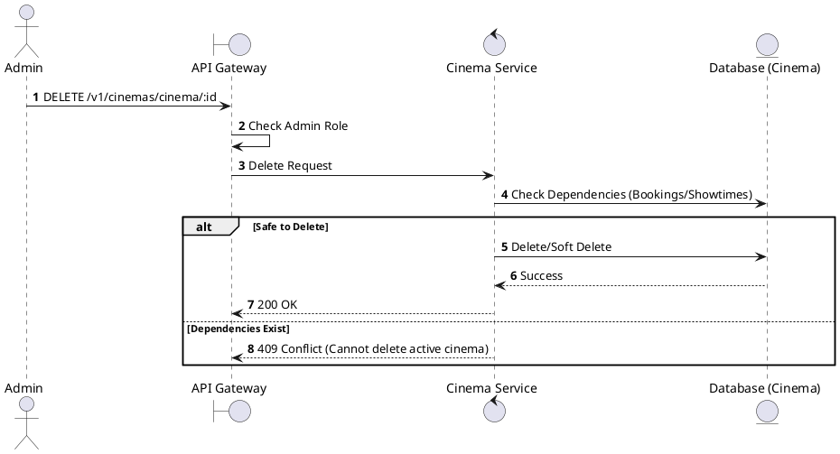
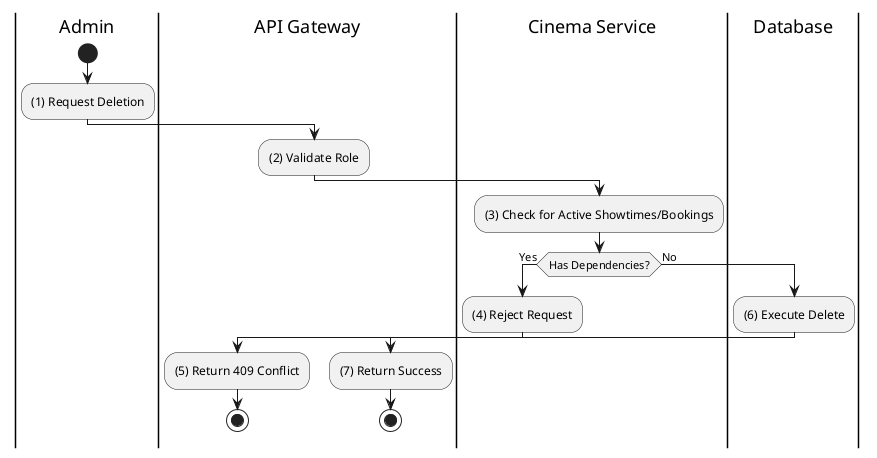

# [CM-04] Delete Cinema

## 1. Description

| Field | Details |
| :--- | :--- |
| **Name** | Delete Cinema |
| **Functional ID** | CM-04 |
| **Description** | Soft-deletes or permanently removes a cinema from the system. |
| **Actor** | Admin |
| **Trigger** | `DELETE /v1/cinemas/cinema/:cinemaId` |
| **Pre-condition** | Admin authenticated; Cinema exists. |
| **Post-condition** | Cinema removed or marked deleted. |

## 2. Sequence Flow

## 3. Activity Flow

## 4. Business Rules

| Activity Step | Rule ID | Description |
| :--- | :--- | :--- |
| (3) | General | Typically, cinemas with past historical data (bookings) should be Soft Deleted (status = CLOSED/DELETED) rather than physically removed to preserve reporting integrity. |
