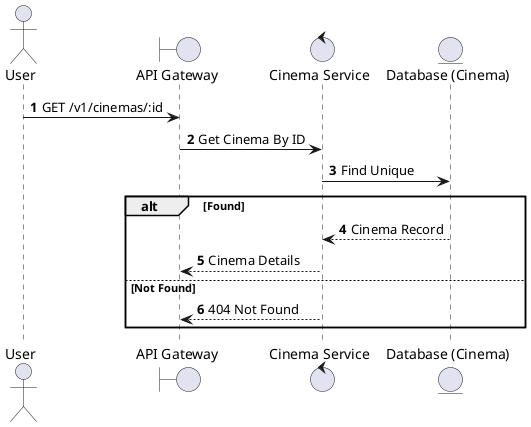
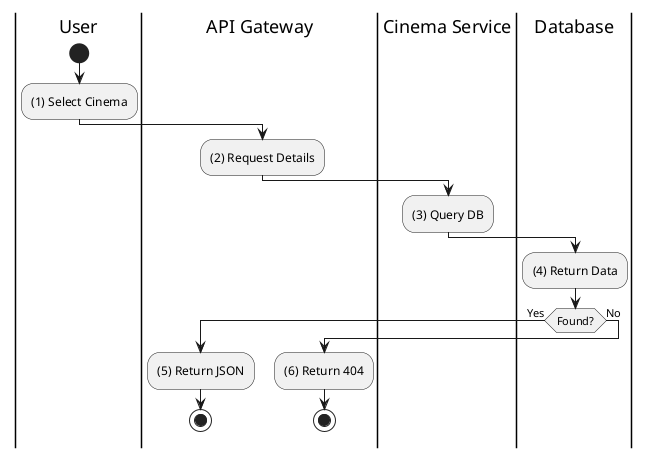

# [CM-05] Get Cinema Detail

## 1. Description

| Field | Details |
| :--- | :--- |
| **Name** | Get Cinema Detail |
| **Functional ID** | CM-05 |
| **Description** | Retrieves full details of a specific cinema, including amenities, address, and description. |
| **Actor** | Guest, Member |
| **Trigger** | `GET /v1/cinemas/:id` |
| **Pre-condition** | None. |
| **Post-condition** | Detailed cinema object returned. |

## 2. Sequence Flow

## 3. Activity Flow

## 4. Business Rules

| Activity Step | Rule ID | Description |
| :--- | :--- | :--- |
| (1) | N/A | Standard Read Operation. |
