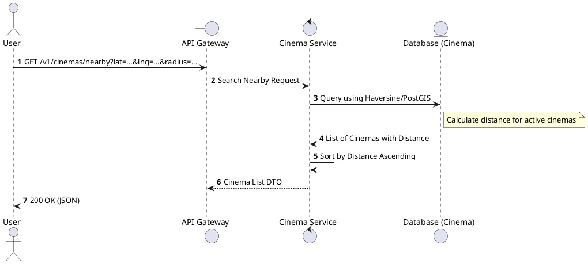
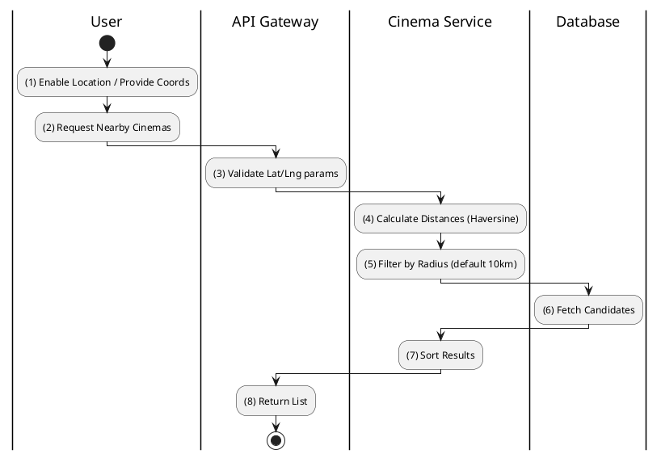

# [CM-06] Search Cinemas Nearby

## 1. Description

| Field | Details |
| :--- | :--- |
| **Name** | Search Cinemas Nearby |
| **Functional ID** | CM-06 |
| **Description** | Finds cinemas located within a certain radius of the user's provided coordinates (latitude/longitude). |
| **Actor** | Guest, Member |
| **Trigger** | `GET /v1/cinemas/nearby` |
| **Pre-condition** | User provides valid `lat` and `lng` query parameters. |
| **Post-condition** | List of cinemas sorted by distance returned. |

## 2. Sequence Flow

## 3. Activity Flow

## 4. Business Rules

| Activity Step | Rule ID | Description |
| :--- | :--- | :--- |
| (5) | General | Default search radius is typically 10km or 20km if not specified. |
| (6) | SRS 5.2 | Only `ACTIVE` cinemas are returned. |
