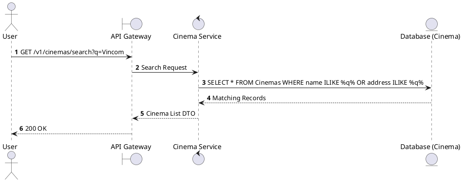
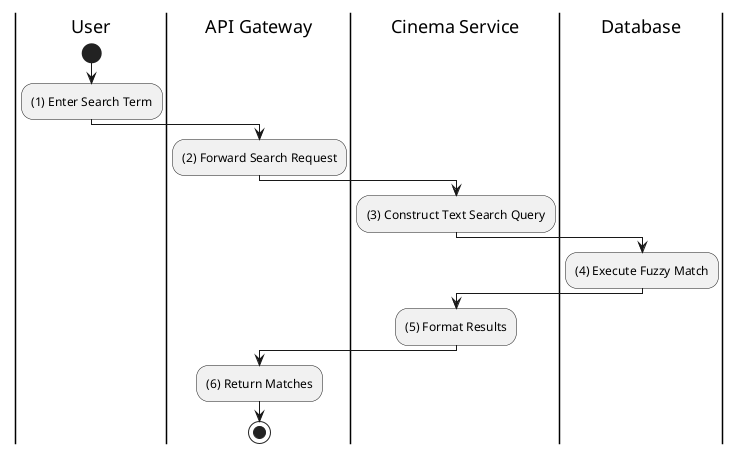

# [CM-07] Search Cinemas by Query

## 1. Description

| Field | Details |
| :--- | :--- |
| **Name** | Search Cinemas by Query |
| **Functional ID** | CM-07 |
| **Description** | Allows users to search for cinemas by name or address using a text string. |
| **Actor** | Guest, Member |
| **Trigger** | `GET /v1/cinemas/search` |
| **Pre-condition** | Query string provided (e.g., `q=Galaxy`). |
| **Post-condition** | List of matching cinemas returned. |

## 2. Sequence Flow

## 3. Activity Flow

## 4. Business Rules

| Activity Step | Rule ID | Description |
| :--- | :--- | :--- |
| (3) | General | Search should be case-insensitive. |
