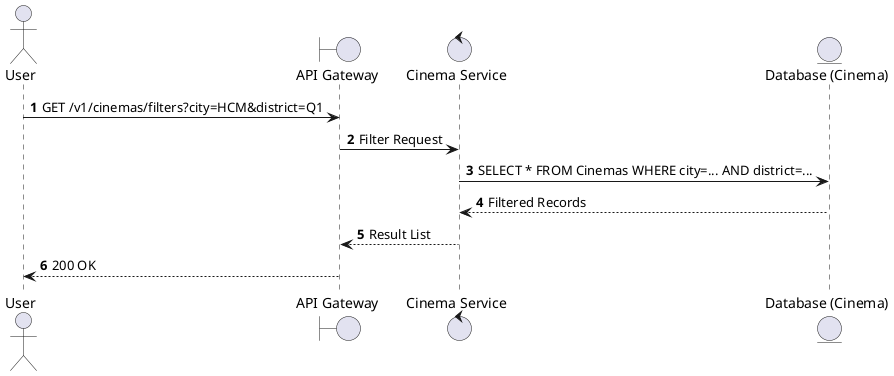
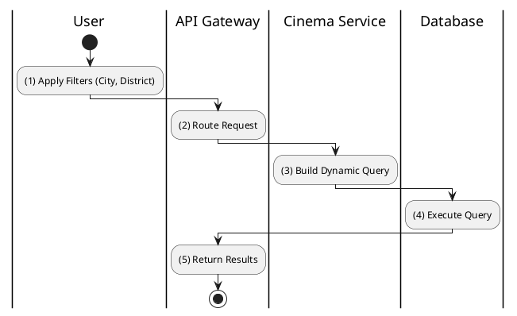

# [CM-08] Filter Cinemas

## 1. Description

| Field | Details |
| :--- | :--- |
| **Name** | Filter Cinemas |
| **Functional ID** | CM-08 |
| **Description** | Allows detailed filtering of cinemas by multiple criteria such as City, District, or Brand (if applicable). |
| **Actor** | Guest, Member |
| **Trigger** | `GET /v1/cinemas/filters` |
| **Pre-condition** | Filter parameters provided. |
| **Post-condition** | Filtered list returned. |

## 2. Sequence Flow

## 3. Activity Flow

## 4. Business Rules

| Activity Step | Rule ID | Description |
| :--- | :--- | :--- |
| (1) | SRS 3.2.1 | Supports City and District filtering primarily. |
