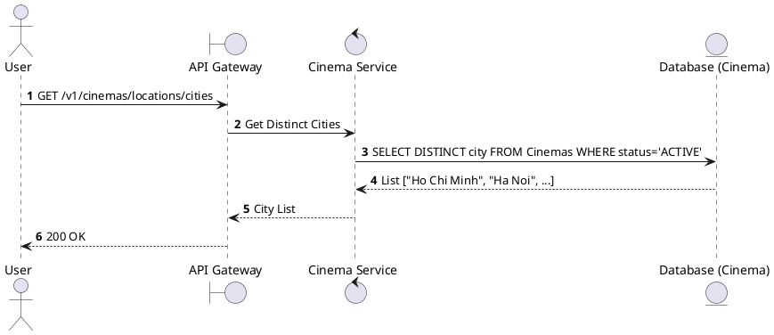
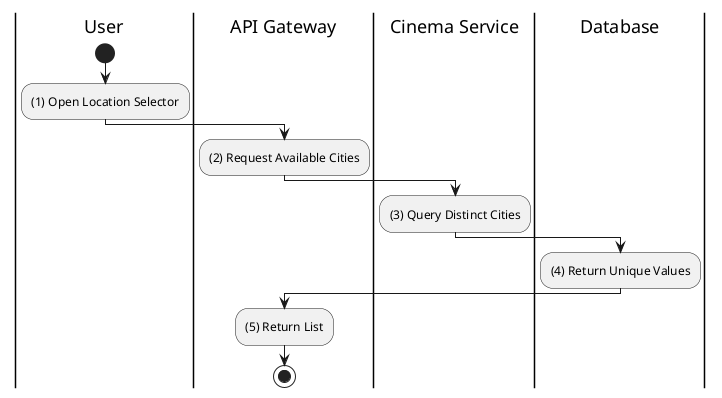

# [CM-09] Get Available Cities

## 1. Description

| Field | Details |
| :--- | :--- |
| **Name** | Get Available Cities |
| **Functional ID** | CM-09 |
| **Description** | Returns a list of all unique cities where at least one active cinema exists. Used for populating UI dropdowns. |
| **Actor** | Guest, Member |
| **Trigger** | `GET /v1/cinemas/locations/cities` |
| **Pre-condition** | None. |
| **Post-condition** | List of distinct city names returned. |

## 2. Sequence Flow

## 3. Activity Flow

## 4. Business Rules

| Activity Step | Rule ID | Description |
| :--- | :--- | :--- |
| (3) | N/A | Only cities with *active* cinemas should be returned to avoid empty search results. |
