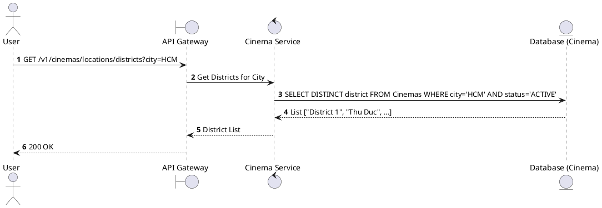
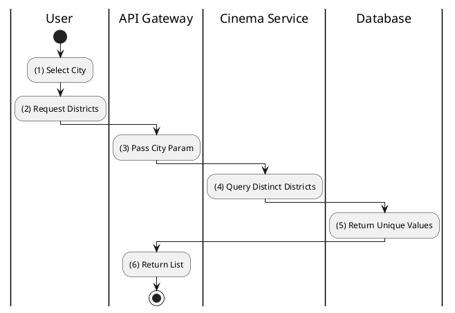

# [CM-10] Get Available Districts

## 1. Description

| Field | Details |
| :--- | :--- |
| **Name** | Get Available Districts |
| **Functional ID** | CM-10 |
| **Description** | Returns a list of districts for a specific city where cinemas are located. |
| **Actor** | Guest, Member |
| **Trigger** | `GET /v1/cinemas/locations/districts` |
| **Pre-condition** | City parameter provided (e.g., `?city=Ho Chi Minh`). |
| **Post-condition** | List of distinct districts returned. |

## 2. Sequence Flow

## 3. Activity Flow

## 4. Business Rules

| Activity Step | Rule ID | Description |
| :--- | :--- | :--- |
| (4) | N/A | Dependent on the selected city. |
