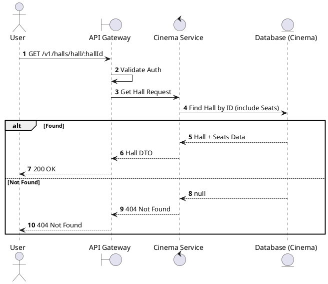
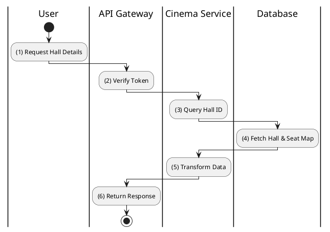

# [HM-01] Get Hall by ID

## 1. Description

| Field | Details |
| :--- | :--- |
| **Name** | Get Hall by ID |
| **Functional ID** | HM-01 |
| **Description** | Retrieves detailed information about a specific cinema hall, including its seat layout and type. |
| **Actor** | Member, Admin |
| **Trigger** | `GET /v1/halls/hall/:hallId` |
| **Pre-condition** | Hall ID exists; User is authenticated. |
| **Post-condition** | Hall details and seat matrix returned. |

## 2. Sequence Flow

## 3. Activity Flow

## 4. Business Rules

| Activity Step | Rule ID | Description |
| :--- | :--- | :--- |
| (4) | N/A | Returns full seat layout including row/col coordinates and types (VIP/Standard). |
