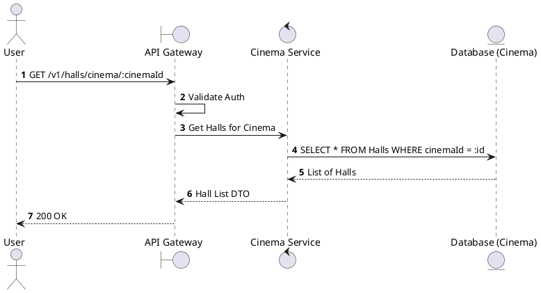
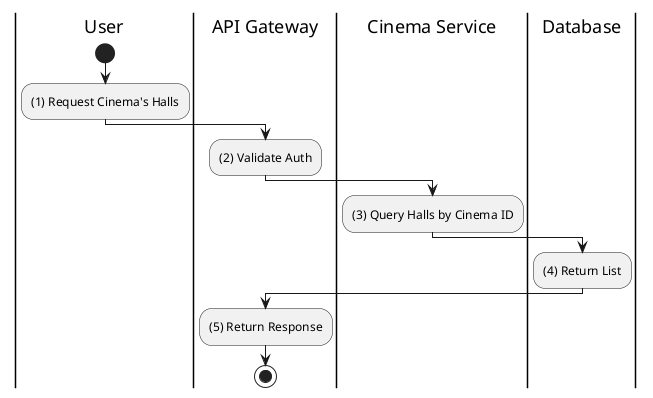

# [HM-02] Get Halls of Cinema

## 1. Description

| Field | Details |
| :--- | :--- |
| **Name** | Get Halls of Cinema |
| **Functional ID** | HM-02 |
| **Description** | Retrieves a list of all halls belonging to a specific cinema location. |
| **Actor** | Member, Admin |
| **Trigger** | `GET /v1/halls/cinema/:cinemaId` |
| **Pre-condition** | Cinema ID exists; User authenticated. |
| **Post-condition** | List of halls returned. |

## 2. Sequence Flow

## 3. Activity Flow

## 4. Business Rules

| Activity Step | Rule ID | Description |
| :--- | :--- | :--- |
| (3) | SRS 5.2 | Should return halls regardless of status (Active/Maintenance) for Admins, but maybe filter for Members? (SRS implies general access, assumed all visible). |
