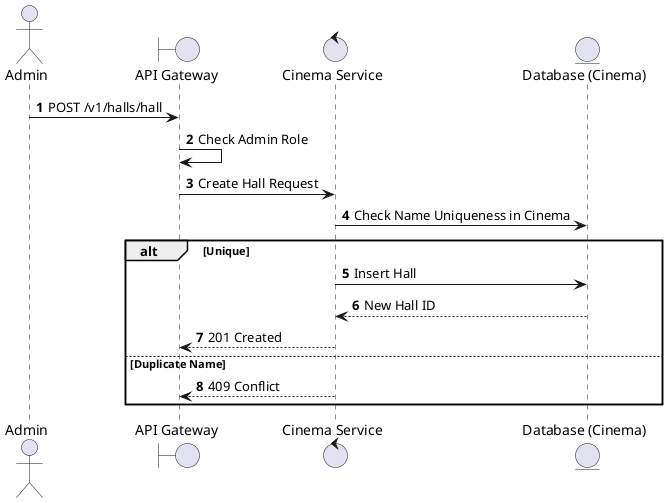
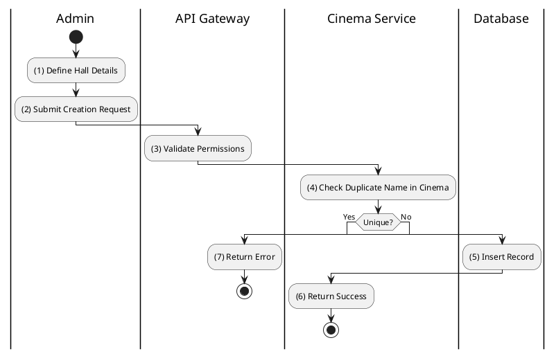

# [HM-03] Create Hall

## 1. Description

| Field | Details |
| :--- | :--- |
| **Name** | Create Hall |
| **Functional ID** | HM-03 |
| **Description** | Creates a new hall within a cinema, defining its name, type, and total seat capacity. Note: Seat layout is usually generated separately or initialized here. |
| **Actor** | Admin |
| **Trigger** | `POST /v1/halls/hall` |
| **Pre-condition** | Admin authenticated; Valid payload (CinemaId, Name, Type). |
| **Post-condition** | New Hall created. |

## 2. Sequence Flow

## 3. Activity Flow

## 4. Business Rules

| Activity Step | Rule ID | Description |
| :--- | :--- | :--- |
| (4) | General | Hall names (e.g., "Hall 1") must be unique within a single Cinema. |
