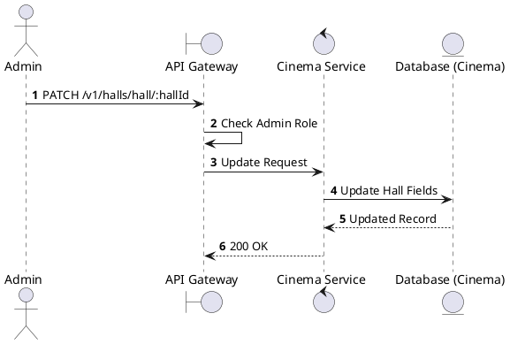
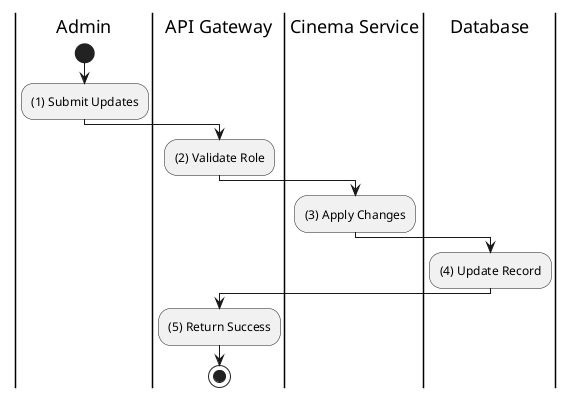

# [HM-04] Update Hall

## 1. Description

| Field | Details |
| :--- | :--- |
| **Name** | Update Hall |
| **Functional ID** | HM-04 |
| **Description** | Updates hall details such as name, type (IMAX, standard), or operational status. |
| **Actor** | Admin |
| **Trigger** | `PATCH /v1/halls/hall/:hallId` |
| **Pre-condition** | Admin authenticated; Hall exists. |
| **Post-condition** | Hall record updated. |

## 2. Sequence Flow

## 3. Activity Flow

## 4. Business Rules

| Activity Step | Rule ID | Description |
| :--- | :--- | :--- |
| (3) | SRS 5.2 | Status changes (e.g., to MAINTENANCE) must be handled carefully if future showtimes exist (Manual process implied). |
