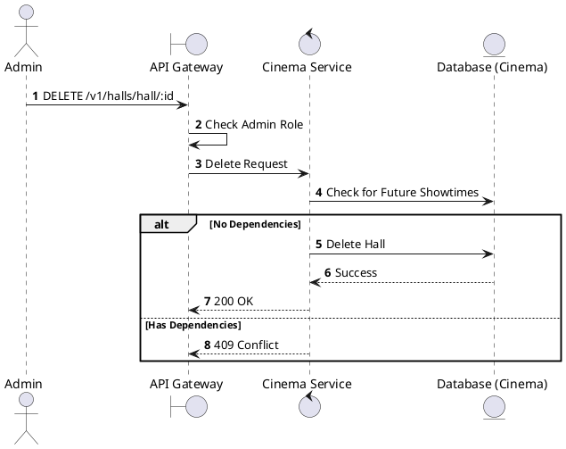
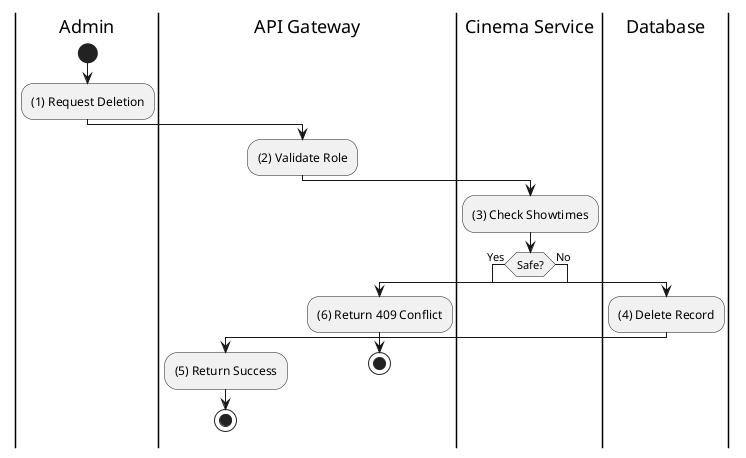

# [HM-05] Delete Hall

## 1. Description

| Field | Details |
| :--- | :--- |
| **Name** | Delete Hall |
| **Functional ID** | HM-05 |
| **Description** | Removes a hall from the system. |
| **Actor** | Admin |
| **Trigger** | `DELETE /v1/halls/hall/:hallId` |
| **Pre-condition** | Admin authenticated; No active showtimes/bookings linked. |
| **Post-condition** | Hall deleted. |

## 2. Sequence Flow

## 3. Activity Flow

## 4. Business Rules

| Activity Step | Rule ID | Description |
| :--- | :--- | :--- |
| (3) | General | Halls with historical data should be soft-deleted. |
