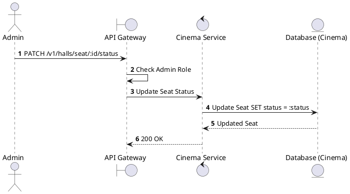
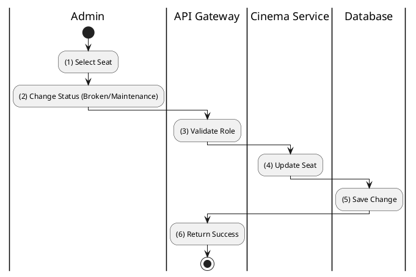

# [HM-06] Update Seat Status

## 1. Description

| Field | Details |
| :--- | :--- |
| **Name** | Update Seat Status |
| **Functional ID** | HM-06 |
| **Description** | Allows modifying the status of a specific seat (e.g., mark as BROKEN or MAINTENANCE) to prevent booking. |
| **Actor** | Admin |
| **Trigger** | `PATCH /v1/halls/seat/:seatId/status` |
| **Pre-condition** | Admin authenticated. |
| **Post-condition** | Seat status updated. |

## 2. Sequence Flow

## 3. Activity Flow

## 4. Business Rules

| Activity Step | Rule ID | Description |
| :--- | :--- | :--- |
| (4) | SRS 5.2 | If a seat is marked BROKEN, it must be excluded from future booking availability calculations. |
