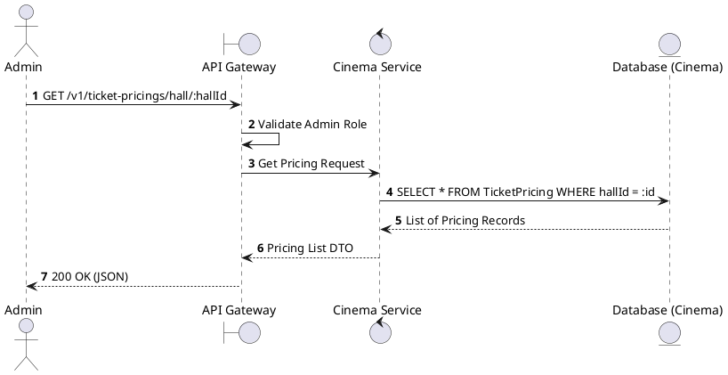
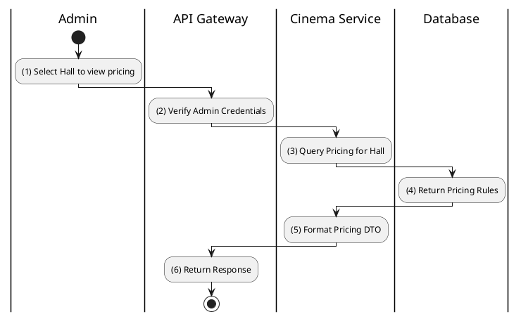

# [TP-01] Get Pricing for Hall

## 1. Description

| Field | Details |
| :--- | :--- |
| **Name** | Get Pricing for Hall |
| **Functional ID** | TP-01 |
| **Description** | Retrieves the ticket pricing configuration for a specific hall, which includes pricing by seat type (Standard, VIP, etc.) and day type (Weekday, Weekend, Holiday). |
| **Actor** | Admin |
| **Trigger** | `GET /v1/ticket-pricings/hall/:hallId` |
| **Pre-condition** | Admin authenticated; Hall ID exists. |
| **Post-condition** | List of pricing rules for the hall is returned. |

## 2. Sequence Flow

## 3. Activity Flow

## 4. Business Rules

| Activity Step | Rule ID | Description |
| :--- | :--- | :--- |
| (4) | SRS 5.2 | Pricing is defined by the combination of `SeatType` and `DayType`. |
