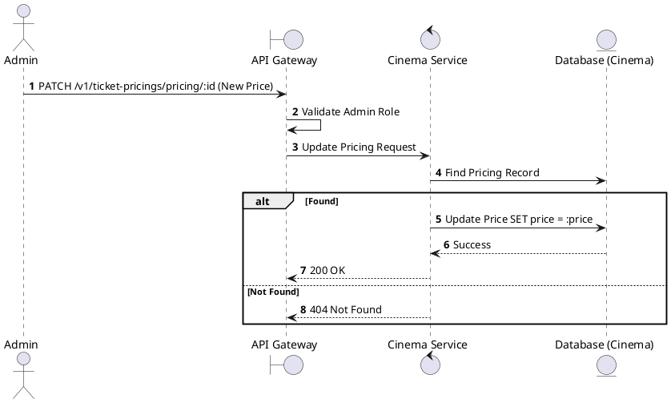
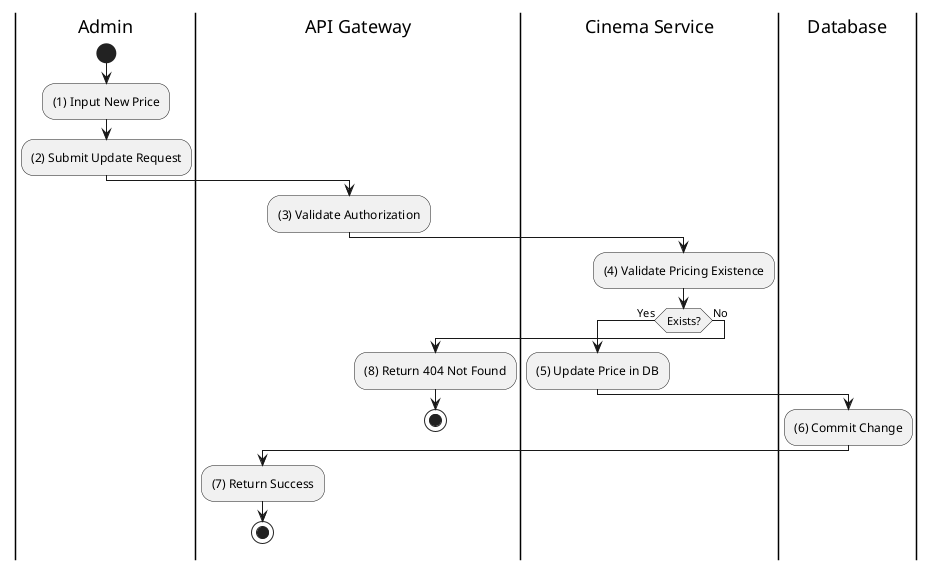

# [TP-02] Update Ticket Pricing

## 1. Description

| Field | Details |
| :--- | :--- |
| **Name** | Update Ticket Pricing |
| **Functional ID** | TP-02 |
| **Description** | Allows an Admin to update the price for a specific pricing rule (e.g., change the price of a VIP seat on Weekends). |
| **Actor** | Admin |
| **Trigger** | `PATCH /v1/ticket-pricings/pricing/:pricingId` |
| **Pre-condition** | Admin authenticated; Pricing ID exists; Valid price value provided. |
| **Post-condition** | Pricing record is updated. |

## 2. Sequence Flow

## 3. Activity Flow

## 4. Business Rules

| Activity Step | Rule ID | Description |
| :--- | :--- | :--- |
| (5) | N/A | Prices must be positive numerical values. |
| (5) | N/A | Changes to pricing do not affect bookings already confirmed, only future ones. |
