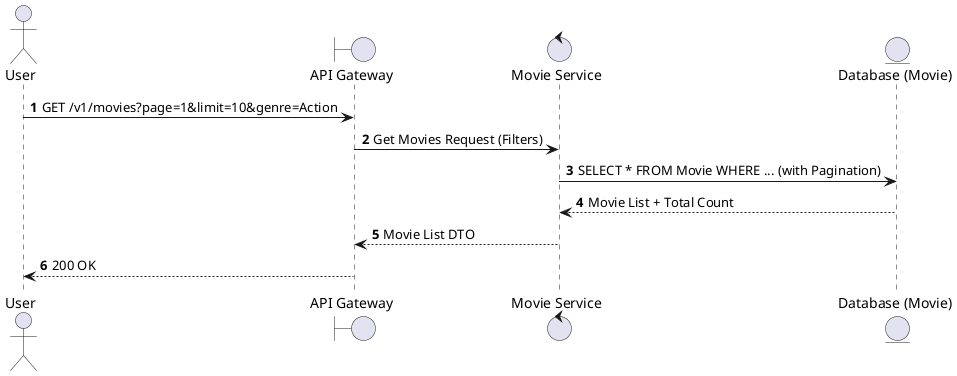
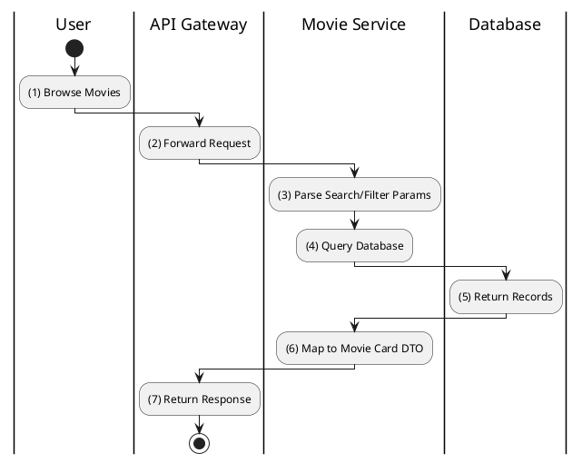

# [MV-01] List Movies

## 1. Description

| Field | Details |
| :--- | :--- |
| **Name** | List Movies |
| **Functional ID** | MV-01 |
| **Description** | Retrieves a list of movies available in the catalog, supporting pagination, searching, and filtering by genre or age rating. |
| **Actor** | Guest, Member |
| **Trigger** | `GET /v1/movies` |
| **Pre-condition** | None. |
| **Post-condition** | List of movies returned. |

## 2. Sequence Flow

## 3. Activity Flow

## 4. Business Rules

| Activity Step | Rule ID | Description |
| :--- | :--- | :--- |
| (3) | N/A | Supports filtering by `genre`, `ageRating`, and searching by `title`. |
| (6) | SRS 5.2 | Returns basic info: Title, Poster, Age Rating, Duration. |
