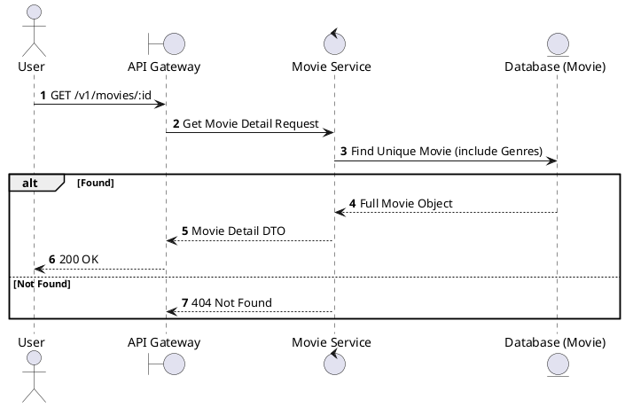
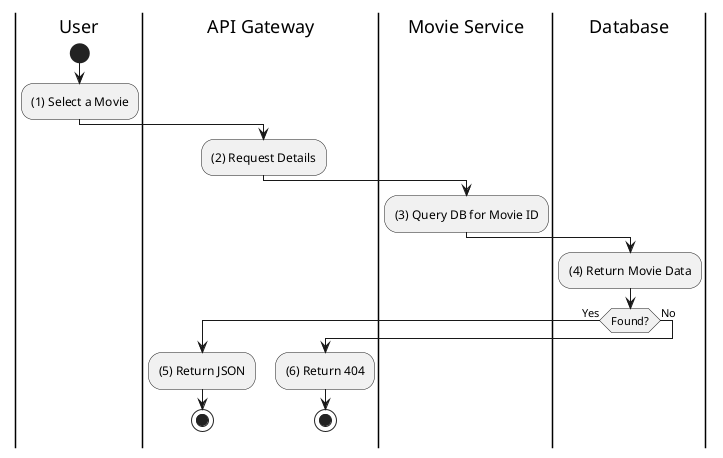

# [MV-02] Get Movie Details

## 1. Description

| Field | Details |
| :--- | :--- |
| **Name** | Get Movie Details |
| **Functional ID** | MV-02 |
| **Description** | Retrieves comprehensive information about a specific movie, including its overview, cast, crew, and genres. |
| **Actor** | Guest, Member |
| **Trigger** | `GET /v1/movies/:id` |
| **Pre-condition** | Movie ID exists. |
| **Post-condition** | Detailed movie information returned. |

## 2. Sequence Flow

## 3. Activity Flow

## 4. Business Rules

| Activity Step | Rule ID | Description |
| :--- | :--- | :--- |
| (4) | N/A | Includes Title, Overview, Release Date, Trailer URL, Poster, Backdrop, Runtime, and Age Rating (SRS 5.1). |
