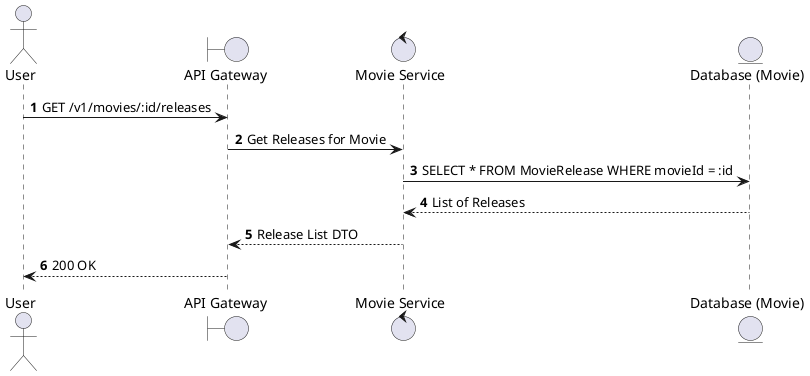
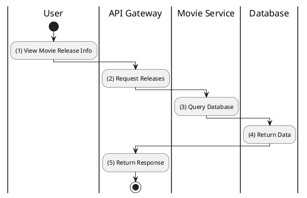

# [MV-03] Get Movie Releases

## 1. Description

| Field | Details |
| :--- | :--- |
| **Name** | Get Movie Releases |
| **Functional ID** | MV-03 |
| **Description** | Retrieves the release dates and statuses for a specific movie in different regions or formats. |
| **Actor** | Guest, Member |
| **Trigger** | `GET /v1/movies/:id/releases` |
| **Pre-condition** | Movie ID exists. |
| **Post-condition** | List of releases returned. |

## 2. Sequence Flow

## 3. Activity Flow

## 4. Business Rules

| Activity Step | Rule ID | Description |
| :--- | :--- | :--- |
| (3) | N/A | Movie releases define the "Showing" or "Upcoming" status of a movie. |
