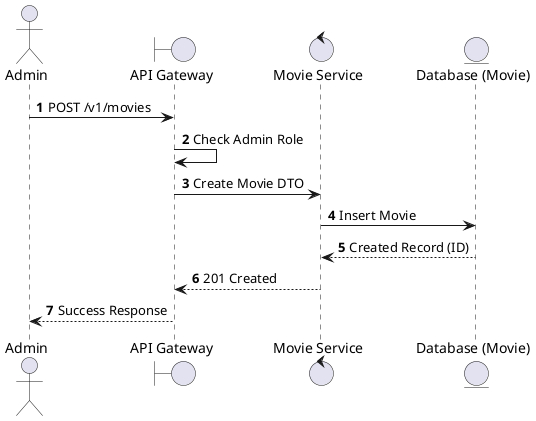
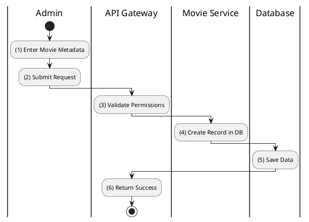

# [MV-04] Create Movie

## 1. Description

| Field | Details |
| :--- | :--- |
| **Name** | Create Movie |
| **Functional ID** | MV-04 |
| **Description** | Allows an Administrator to add a new movie to the platform. |
| **Actor** | Admin |
| **Trigger** | `POST /v1/movies` |
| **Pre-condition** | Admin authenticated; Valid payload. |
| **Post-condition** | Movie created in database. |

## 2. Sequence Flow

## 3. Activity Flow

## 4. Business Rules

| Activity Step | Rule ID | Description |
| :--- | :--- | :--- |
| (1) | SRS 5.1 | Required: Title, Overview, Poster URL, Backdrop URL, Trailer URL, Release Date, Runtime, Age Rating. |
