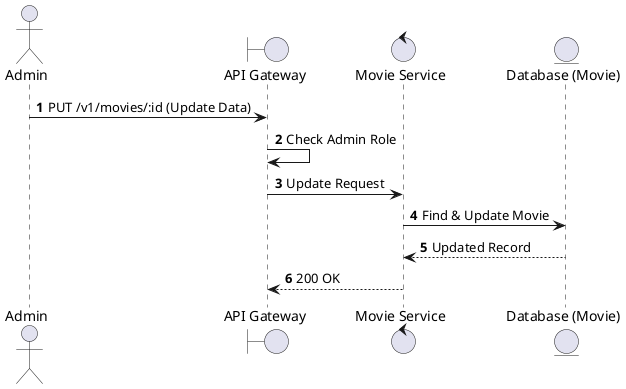
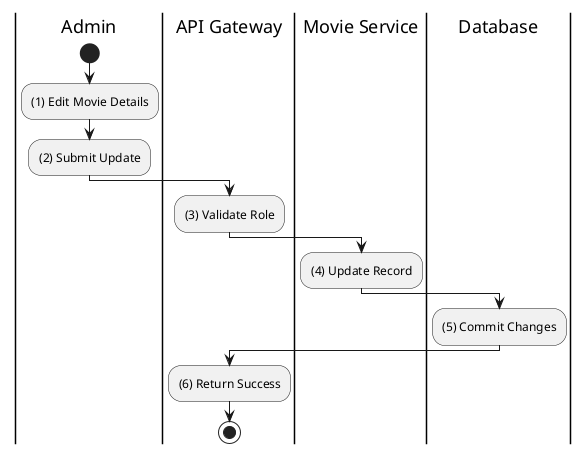

# [MV-05] Update Movie

## 1. Description

| Field | Details |
| :--- | :--- |
| **Name** | Update Movie |
| **Functional ID** | MV-05 |
| **Description** | Modifies the information of an existing movie. |
| **Actor** | Admin |
| **Trigger** | `PUT /v1/movies/:id` |
| **Pre-condition** | Admin authenticated; Movie ID exists. |
| **Post-condition** | Movie record updated. |

## 2. Sequence Flow

## 3. Activity Flow

## 4. Business Rules

| Activity Step | Rule ID | Description |
| :--- | :--- | :--- |
| (4) | N/A | Can update title, overview, release date, runtime, poster, trailer, backdrop, age rating. |
| (4) | SRS 5.1 | Updates to genres should also be handled (if included in payload). |
