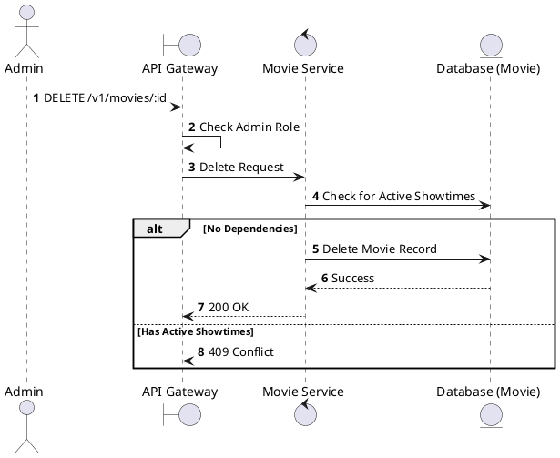
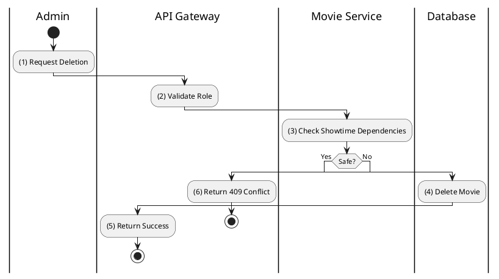

# [MV-06] Delete Movie

## 1. Description

| Field | Details |
| :--- | :--- |
| **Name** | Delete Movie |
| **Functional ID** | MV-06 |
| **Description** | Removes a movie from the catalog. |
| **Actor** | Admin |
| **Trigger** | `DELETE /v1/movies/:id` |
| **Pre-condition** | Admin authenticated; No active showtimes linked. |
| **Post-condition** | Movie deleted. |

## 2. Sequence Flow

## 3. Activity Flow

## 4. Business Rules

| Activity Step | Rule ID | Description |
| :--- | :--- | :--- |
| (3) | General | A movie cannot be deleted if it is currently scheduled for screening (to prevent orphaned showtimes). |
