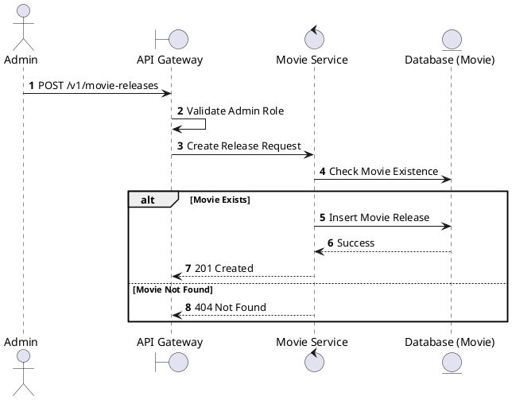
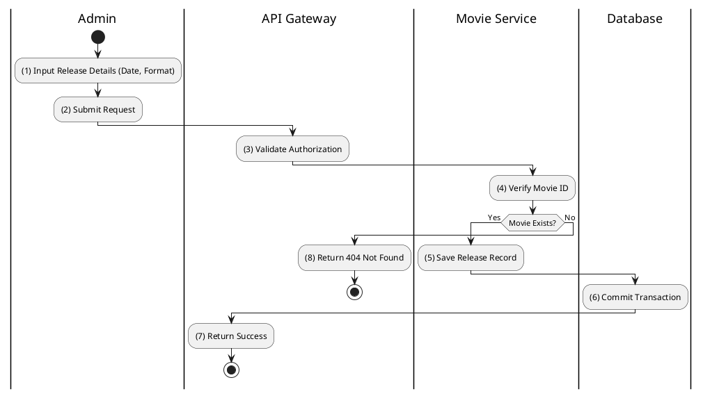

# [MR-01] Create Movie Release

## 1. Description

| Field | Details |
| :--- | :--- |
| **Name** | Create Movie Release |
| **Functional ID** | MR-01 |
| **Description** | Creates a new release entry for a movie, specifying the release date, end date, and format (e.g., 2D, 3D, IMAX). |
| **Actor** | Admin |
| **Trigger** | `POST /v1/movie-releases` |
| **Pre-condition** | Admin authenticated; Movie ID exists; Valid release dates. |
| **Post-condition** | Movie release record created. |

## 2. Sequence Flow

## 3. Activity Flow

## 4. Business Rules

| Activity Step | Rule ID | Description |
| :--- | :--- | :--- |
| (1) | N/A | Format must be one of: `TWO_D`, `THREE_D`, `IMAX`, `FOUR_DX` (Movie Service Enums). |
| (1) | N/A | End date must be after the release date. |
