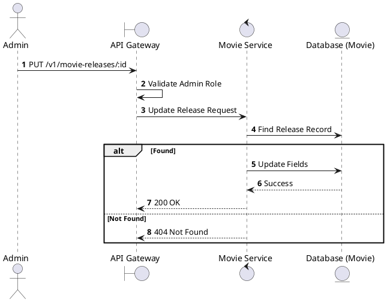
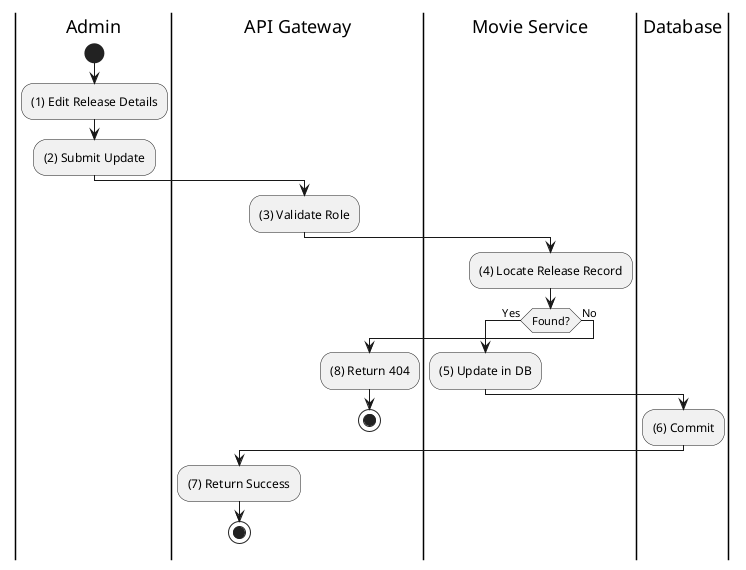

# [MR-02] Update Movie Release

## 1. Description

| Field | Details |
| :--- | :--- |
| **Name** | Update Movie Release |
| **Functional ID** | MR-02 |
| **Description** | Updates an existing movie release's schedule or format. |
| **Actor** | Admin |
| **Trigger** | `PUT /v1/movie-releases/:id` |
| **Pre-condition** | Admin authenticated; Release ID exists. |
| **Post-condition** | Movie release updated. |

## 2. Sequence Flow

## 3. Activity Flow

## 4. Business Rules

| Activity Step | Rule ID | Description |
| :--- | :--- | :--- |
| (5) | N/A | Updating a release format or date might affect scheduled showtimes (Manual reconciliation required). |
