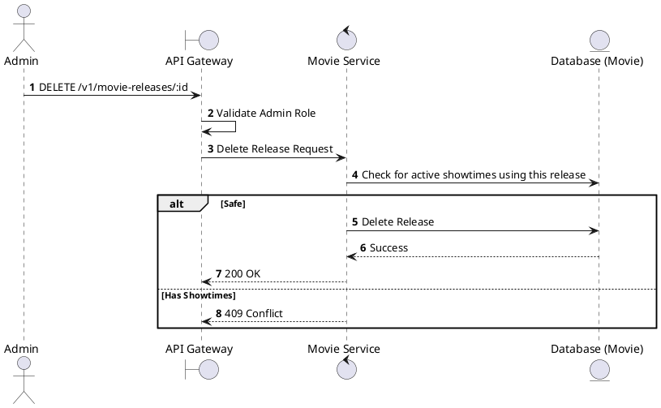
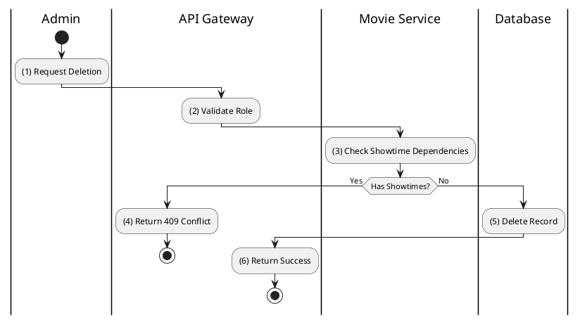

# [MR-03] Delete Movie Release

## 1. Description

| Field | Details |
| :--- | :--- |
| **Name** | Delete Movie Release |
| **Functional ID** | MR-03 |
| **Description** | Deletes a movie release entry. |
| **Actor** | Admin |
| **Trigger** | `DELETE /v1/movie-releases/:id` |
| **Pre-condition** | Admin authenticated; Release exists. |
| **Post-condition** | Release record removed. |

## 2. Sequence Flow

## 3. Activity Flow

## 4. Business Rules

| Activity Step | Rule ID | Description |
| :--- | :--- | :--- |
| (3) | General | Deleting a release is prevented if it's currently linked to active showtimes. |
