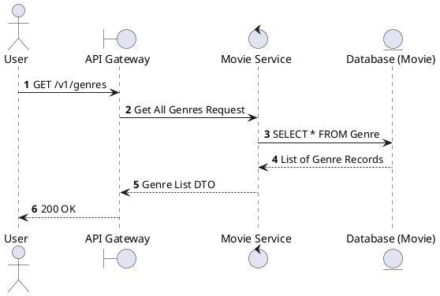
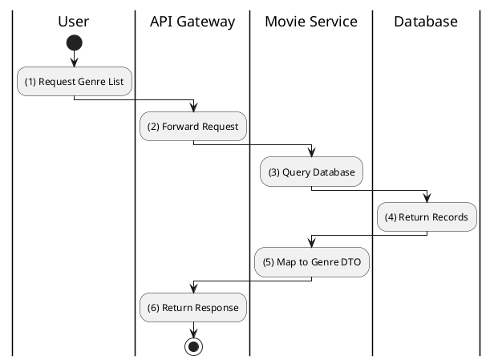

# [GM-01] List All Genres

## 1. Description

| Field | Details |
| :--- | :--- |
| **Name** | List All Genres |
| **Functional ID** | GM-01 |
| **Description** | Retrieves a list of all movie genres available in the system. |
| **Actor** | Guest, Member |
| **Trigger** | `GET /v1/genres` |
| **Pre-condition** | None. |
| **Post-condition** | List of genres returned. |

## 2. Sequence Flow

## 3. Activity Flow

## 4. Business Rules

| Activity Step | Rule ID | Description |
| :--- | :--- | :--- |
| (3) | N/A | Returns all genres defined in the movie service database. |
