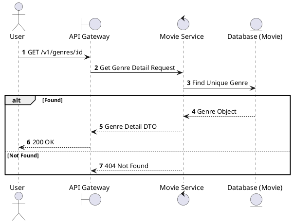
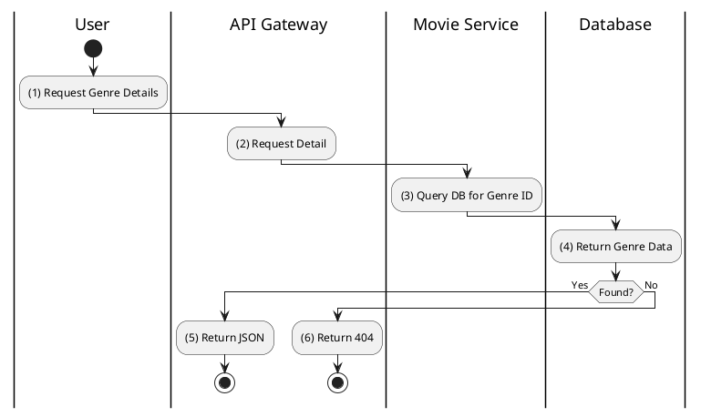

# [GM-02] Get Genre by ID

## 1. Description

| Field | Details |
| :--- | :--- |
| **Name** | Get Genre by ID |
| **Functional ID** | GM-02 |
| **Description** | Retrieves detailed information about a specific genre by its ID. |
| **Actor** | Guest, Member |
| **Trigger** | `GET /v1/genres/:id` |
| **Pre-condition** | Genre ID exists. |
| **Post-condition** | Genre details returned. |

## 2. Sequence Flow

## 3. Activity Flow

## 4. Business Rules

| Activity Step | Rule ID | Description |
| :--- | :--- | :--- |
| (1) | N/A | Standard read operation for a single genre. |
