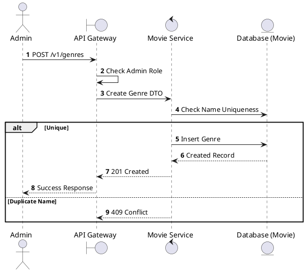
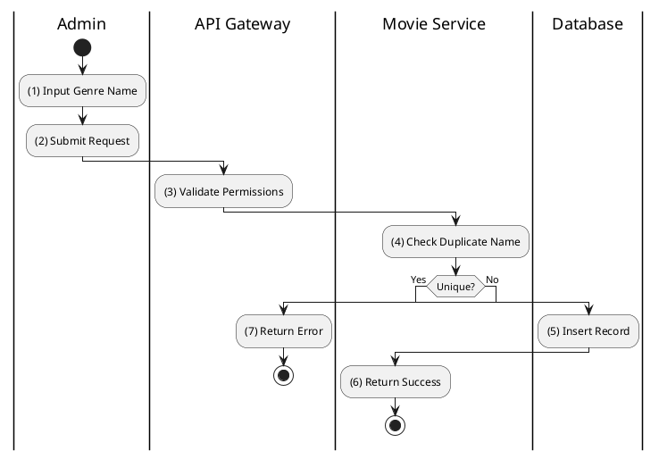

# [GM-03] Create Genre

## 1. Description

| Field | Details |
| :--- | :--- |
| **Name** | Create Genre |
| **Functional ID** | GM-03 |
| **Description** | Allows an Administrator to add a new movie genre to the system. |
| **Actor** | Admin |
| **Trigger** | `POST /v1/genres` |
| **Pre-condition** | Admin authenticated; Valid payload (name). |
| **Post-condition** | New genre created in database. |

## 2. Sequence Flow

## 3. Activity Flow

## 4. Business Rules

| Activity Step | Rule ID | Description |
| :--- | :--- | :--- |
| (4) | General | Genre names must be unique in the system. |
